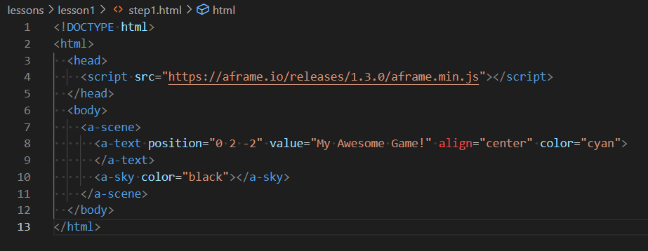

# Lesson 1 - Creating a Title Page

This lesson creates a simple title page for our game.  We use this as a way to gently introduce a range of important HTML and 

JavaScript concepts.

### This Lesson's New Tool

Each lesson will begin by introducing a new tool.

Our first tool is a text editor, which can be used to create and edit plain text files locally on your computer.

I'd recommend [Visual Studio Code](https://code.visualstudio.com/) as a text editor, but if you prefer to use a different text editor, that should be fine.

A text editor allows you to create, modify and save text files.  Many text editors (including Visual Studio Code) have features that assist with development of code, such as automatically colouring code based on syntax, highlighting matching parentheses/brackets, indenting, and so on.




It's also possible to write code in your browser, storing your code in the cloud using a service like [glitch.com](https://glitch.com/).  If you want to do that, you'll be able to follow along for most of this tutorial, but there will be a few places where you'll need to do things differently  (serving / viewing pages, version control etc.), and you'll need to figure these out for yourself.


### Our first piece of code

Within you r text editor, copy and paste this code into a new file (or type it in, if you prefer)

```
<!DOCTYPE html>
<html>
  <head>
    <script src="https://aframe.io/releases/1.3.0/aframe.min.js"></script>
  </head>
  <body>
    <a-scene>
      <a-text position="0 2 -2" value="My Awesome Game!" align="center" color="cyan">
      </a-text>
      <a-sky color="black"></a-sky>
    </a-scene>
  </body>
</html>
```


Pick a suitable location for your work (e.g. `\Documents\coding\my-game\`) and save this file with the name `index.html`

Now view this file in your browser (any modern browser should be fine, but this tutorial is written assuming you are using Chrome).  On Windows, the easiest way to open the file in a browser is to navigate to the file in Explorer, then right-click > Open with... > Chrome.


Within your browser, you should see something like this:


[Code](https://github.com/diarmidmackenzie/aframe-game-tutorial/blob/main/lessons/lesson1/step1.html) [Demo](https://diarmidmackenzie.github.io/aframe-game-tutorial/lessons/lesson1/step1.html)

This looks like simple text, but it's actually a part of a 3D environment.  Try holding down the left mouse button and moving it around.  You can also used WASD to move your viewpoint around the text.


Now change the text "My Awesome Game!" in the code above to whatever you'd like to name your game.  And you can change the text color "cyan" and the background color "black" as you wish.

You can use any of the colors listed here:
https://www.w3schools.com/colors/colors_names.asp

Or you can use a custom RGB value like this `"#ECECEC"`

Here's a line-by-line explanation of the code...

> ```
><!DOCTYPE html>
> ```
> 
> This line just declares that this is an HTML document.
>
> ```
><html>
> ...
> </html>
> ```
> 
> An HTML document is made up of elements, which can be nested inside one another.
>
> An element begins with an opening tag like this `<tag>` and ends with a closing tag like this `</tag>`
>
> You'll sometimes also see elements that open and close immediately like this `<tag/>` - these elements can't have any nested content.
>
> The top-level element for any HTML document uses the `html` tag.
>
> ```
><head>
>  <script src="https://aframe.io/releases/1.3.0/aframe.min.js"></script>
>   </head>
>    ```
>   
> Inside the `html` element, there are two key elements, the `head` and the `body`.   The `head` is loaded first, and sets up things that can be used within the `body`
>
> In the `head` above, we set up just one thing, the [A-Frame JavaScript library](https://aframe.io/) (we're using version 1.3.0, which is the latest available version).  By default, HTML only offers 2D layout.  A-Frame extends HTML in a way that allows us to create 3D elements inside web pages as well.  It defines elements that we'll use below such as `a-scene`, `a-text` and `a-sky`
>
> ```
><body>
> ...
>   </body>
>   ```
>   
> After the `head` element, we have the `body` element, which contains the actual content to be displayed on the webpage.  It can refer to things defined in the `head` element.
>
> ```
> <a-scene>
>  ...
>     </a-scene>
>    ```
>    
> An HTML page using A-Frame can only contain one 3D scene.  The `a-scene` element is used to define that 3D scene.
>
> ```
>   <a-text position="0 2 -2" value="My Awesome Game!" align="center" color="cyan">
>     </a-text>
>    ```
>    
> `a-text` is another element defined by A-Frame.  This can be used to display some text within a 3D scene.  It has various attributes that can be set.  Here we set up:
>
> - it's position (0m (i.e. centered) left-right, 2m up, 2m back from the camera).  Note that the default camera is positioned 1.6m above the ground, so 2m up is just above the camera.
>- the text to display in the `value` attribute
> - the alignment: the specified position is in the center of the text.
> - the color of the text (cyan).
> 
> ```
><a-sky color="black"></a-sky>
> ```
> 
> `a-sky` is another A-Frame element, which can be used to describe the background to be used for a 3D scene.  In this case, we specify a simple black background, but we could also use this element to render a 360 image as our background


### Tidying some things up

There's a few things we should tidy up.  The 3D framework we are using (A-Frame) was originally developed as a framework for VR experiences.

Since we're not building for VR (yet!) we need to tweak a few things from their defaults.

Change this line:

```
<a-scene>
```

to this:

```<a-scene vr-mode-ui="enabled: false">```

And immediately after, add this line:

```
<a-entity camera position="0 1.6 0"></a-entity>
```

This changes will:

- disable the "VR" button in the bottom right
- disable the ability to move your view with the mouse & WASD.  We'll add this back in later when we need it in our game.

[Code](https://github.com/diarmidmackenzie/aframe-game-tutorial/blob/main/lessons/lesson1/step2.html) [Demo](https://diarmidmackenzie.github.io/aframe-game-tutorial/lessons/lesson1/step2.html)

Explaining the code in a bit more detail:

>  `vr-mode-ui` is an A-Frame component that can be set as an attribute of `a-scene` , giving control over the VR mode UI.  It is described [here](https://aframe.io/docs/1.3.0/components/vr-mode-ui.html).  In this case, we use it to disable (and hence hide) the VR mode UI.
>
> Every A-Frame scene must have a camera, but if one idn't included, A-Frame includes one by default, and adds mouse & WASD controls.
>
> We use an `a-camera` element to define our own camera without these controls.  By defining our own camera, we prevent A-Frame from adding the default camera.


### Animate the title

Add the following two attributes inside the `<a-text>` element

```
animation="property: rotation; from: 0 0 0; to: 0 360 0; dur: 3000; easing: linear; loop: true"
side="double"
```

The `<a-text>` element should now look something like this (note that the new attributes are added inside the `>` angle bracket).

```
<a-text position="0 2 -2" value="My Awesome Game!" align="center" color="cyan"
   animation="property: rotation; from: 0 0 0; to: 0 360 0; dur: 3000; easing: linear; loop: true"
   side="double">
</a-text>
```

We now have a fancy spinning title!

[Code](https://github.com/diarmidmackenzie/aframe-game-tutorial/blob/main/lessons/lesson1/step3.html) [Demo](https://diarmidmackenzie.github.io/aframe-game-tutorial/lessons/lesson1/step3.html)

In more detail...

> The `animation` component is a powerful A-Frame component that can be set as an attribute on most elements.
>
> It is described in full [here](https://aframe.io/docs/1.3.0/components/animation.html#sidebar).
>
> In our setup, we specify:
>
> - Which property of the text to animate - in this case, its rotation
>- Start and end values for the rotation.  We can rotate around any of 3 different axes (x - left-right, y - top-bottom, or z-front-back).  Here's we've specified a full turn (360 degree) rotation about the vertical (y) axis.
> - `dur` species the duration of the animation in milliseconds.  3000 msecs = 3 seconds.
> - `easing: linear` means that the animation moves at a constant pace.  Other [easing options](https://aframe.io/docs/1.3.0/components/animation.html#easings) allow for animations that accelerate or decelerate.
> - `loop: true` means that the animation loops.  Without this property, the animation would just run once.
> 
> The `side: "double"` attribute ensures that the text is rendered on both sides.  By default most 3D graphics only render one side, for efficiency reasons.  Without this setting, the text would disappear when it was turned away from us.


### Game Start Button

Now let's add a button to start the game.  Add the following code just after `</a-scene>`

```
<button style="position: absolute;
               top: 50%;
               left: 40%;
               width: 20%;
               height: 15%;
               font-size: 150%;
               background: #bbbbff">
      CLICK HERE TO START
</button>
```

This displays a button, but the button doesn't do anything yet.

[Code](https://github.com/diarmidmackenzie/aframe-game-tutorial/blob/main/lessons/lesson1/step4.html) [Demo](https://diarmidmackenzie.github.io/aframe-game-tutorial/lessons/lesson1/step4.html)

Explaining what this code does:

> - `button` is a basic kind of HTML element that puts a clickable button onto a page
>- `style` is an attribute that can be set on most 2D HTML elements, that allows control of a wide range of aspects of the element's appearance.  In this case:
>   - We use "absolute" positioning mode, which means we can specify directly where this element should appear (in other positioning modes, elements are positioned based on the context of other elements around them)
>   - We set the top of the button 50% of the way down the screen, and the left side of it 40% of the way across the screen
>   - We set the button width to 20% of the screen width (so with the left side positioned at 40%, it will be in the middle).  We set the height to 15% of the screen height.
>   - We set a slightly larger than standard font (150%)
>   - An we set a background color of a pale blue using hex RGB code `"#bbbbff"`.  We could also have used a named color like `"LightGrey"`.
> - The content of the `button` element, between the tags, is what is displayed on the button.  In this case, some simple text "CLICK HERE TO START".

To make the button have an effect, we need to write some JavaScript.

Add this additional attribute to the button, again this should be just before the `>`closing brace for the initial `button` tag.

```
onClick="start()"
```

And at the top of the document, just after this line:

```  <script src="https://aframe.io/releases/1.3.0/aframe.min.js"></script>```

add the following lines: 

    <script>
      function start() {
        alert("Starting Game")
      }
    </script>


Now, when you press the button, you should see a pop-up like this:


[Code](https://github.com/diarmidmackenzie/aframe-game-tutorial/blob/main/lessons/lesson1/step5.html) [Demo](https://diarmidmackenzie.github.io/aframe-game-tutorial/lessons/lesson1/step5.html)

To explain this code:

>  - `onClick` is a special attribute that can be set on a button to specify a JavaScript function to invoke when the button is clicked.
>- We define Javascript functions using the `function` key word.  A function describes a series of commands to execute.
>  - JavaScript functions can take input parameters, which affect what the function does.  This function has no input parameters, hence the `()` parentheses are empty.
>  - All this function does at the moment is to create an alert pop-up.  It does this by calling another (built-in) function, `alert()`, passing the message to display as a function parameter.  The alert function is described in full [here](https://developer.mozilla.org/en-US/docs/Web/API/Window/alert).

### Hiding the button

Now, let's hide the button when it's clicked.

To do this we need to do a couple of things:

- Add an `id` attribute to the button like this:

```
id="start"
```

so it should now look like this:

```
    <button id="start" 
            style="position: absolute;
                   top: 50%;
                   left: 40%;
                   width: 20%;
                   height: 15%;
                   font-size: 150%;
                   background: #bbbbff"
             onClick="start()">
```


And in our `start` function, add the following two lines of code.

```
        const startButton = document.getElementById("start")
        startButton.style.display = "none"
```

[Code](https://github.com/diarmidmackenzie/aframe-game-tutorial/blob/main/lessons/lesson1/step6.html) [Demo](https://diarmidmackenzie.github.io/aframe-game-tutorial/lessons/lesson1/step6.html)

Explaining this code...

> - `document.getElementById()` is another built-in Javascript function which searches the document (i.e. the HTML page) for an element with the specified `id` attribute.  It's described in full [here](https://developer.mozilla.org/en-US/docs/Web/API/Document/getElementById).
>- By specifying the `id` attribute on the `button` element, we make it findable by our JavaScript code in this way.  Note that ids such as this should be unique across the whole document, or we might not get the right element.
> - Our code gets the value returned by `document.getElementById("start")` and stores it in a new constant called `startButton`.  The key word `const` is used to declare a constant.
> - Having got an element in JavaScript, we can then modify individual attributes (and their properties) of that element directly.  In this case, we change the `display` property of the `style` attribute to `"none"`, which has the effect of hiding the button.

Now, the start button disappears after we click on it.  But this happens *after* the alert, even though the lines of code come before the `alert` line.


We can fix this by changing this line:

```
          alert("Starting Game")
```

to this:

```
        setTimeout(() => {
          alert("Starting Game")
        }, 100)
```

[Code](https://github.com/diarmidmackenzie/aframe-game-tutorial/blob/main/lessons/lesson1/step7.html) [Demo](https://diarmidmackenzie.github.io/aframe-game-tutorial/lessons/lesson1/step7.html)

Explaining this code...

>  The problem here is that the changes that we make to the page by updating `startButton.style.display` don't happen instantly, whereas the `alert` command does act instantly, and then blocks further updates to the page.
>
>  The result is that we see the alert pop-up instantly, but the hiding of the button doesn't occur until the alert pop-up is dismissed, and updates to the page can begin again.
>
>  The `setTimeout` function is another built-in JavaScript function that we can use to work around this.  It takes two parameters: a function, and a timer (in milliseconds).  It executes the function *after* the specified number of milliseconds.
>
>  The code `() => {...}` defines a function, with the function content being whatever appears between the `{} `curly brackets.
>
>  This is known as an "arrow function" and it's just a different way of defining a function.  There are some subtle differences, but there's no need to worry about them for now.
>
>  We could also have written the code like this:
>
>  ```
>  function showAlert() {
>    alert("Starting Game")
>  }
>  setTimeout(showAlert, 100)
>  ```
>
>  ... or like this...
>
>  ```
>  setTimeout(function showAlert() {
>    alert("Starting Game")
>  }, 100)
>  ```
>
>  There are some subtle differences (which we'll come to later) but for now it's enough to just know that there's two different ways of defining functions, the `function` keyword and the `=>` arrow function construct, which are pretty-much interchangeable.

### Hiding the title

Let's also hide the title.  We can do this in a similar way, but the specific way of hiding 3D elements is different from 2D elements.


Add an `id` attribute to the `<text>` element:

```id="gameTitle"```

so it should now look like this:

```
<a-text id="gameTitle"
   position="0 2 -2" value="My Awesome Game!" align="center" color="cyan"
   animation="property: rotation; from: 0 0 0; to: 0 360 0; dur: 3000; easing: linear; loop: true"
   side="double">
</a-text>
```


and add the following two lines inside the `start()` function, just before `setTimeout` ().

```
        const gameTitle = document.getElementById("gameTitle")
        gameTitle.setAttribute("visible", false)
```
[Code](https://github.com/diarmidmackenzie/aframe-game-tutorial/blob/main/lessons/lesson1/step8.html) [Demo](https://diarmidmackenzie.github.io/aframe-game-tutorial/lessons/lesson1/step8.html)

An explanation of this code...


>  Unlike 2D HTML elements, we don't use a `style` attribute to control the display of 3D elements.  We use a range of different attributes for different aspects of the element's display.  E.g. `position` for position, `scale` for scale etc.
>
>  To control a 3D element's visibility, we use the attribute `visible`, and setting this to `false` causes the element to be hidden.
>
>  A key benefit of hiding the element, rather than deleting it, is that all the other attributes of the element remain (its position, the text it displays etc.), so when we want to show it again we can just set `visible` to `true`, rather than having to recreate the whole element.

### Back to the title page

Finally, lets add some function that returns us to the title page.

Once we have a game, we'll do this after the game is over, but for now we'll do it after just a few seconds.

Add the following new function inside the `<script>` tags:

```
      function gameOver() {
        const startButton = document.getElementById("start")
        startButton.style.display = "block"

        const gameTitle = document.getElementById("gameTitle")
        gameTitle.setAttribute("visible", true)
      }
```


And add the following line of code at the end of the `start()` function:

```
        setTimeout(gameOver, 3000)
```

[Code](https://github.com/diarmidmackenzie/aframe-game-tutorial/blob/main/lessons/lesson1/step9.html) [Demo](https://diarmidmackenzie.github.io/aframe-game-tutorial/lessons/lesson1/step9.html)

An explanation of this code.

> This code re-uses the concepts we introduced in the last few steps, to reinstate the title page when the game "ends".
>
> The start button's display style is set to `block` (which is the default HTML display style), and the `visible` attribute on the `gameTitle` element is set back to `true`.
>
> The `start` function sets a 3 second timeout, after which the `gameOver` function is called.
>
> Note the difference between `gameOver()` which is an instruction to execute the `gameOver` function immediately and `gameOver` which is a reference to the function that can be passed as an argument to the `setTimeout` function.

### Recap

We've only got as far as the title page of our game, but we've already introduced a lot of HTML and JavaScript concepts, which we'll use as we go forwards.

This included...

- HTML pages, including the head and the body
- A-Frame and the <a-scene> element
- HTML elements and attributes, which can be either 2D or 3D (using A-Frame)
- A variety of attributes, including "id", "style" for 2D elements, and "id", "position" and "animation" for 3D elements.
- How to include JavaScript code in an HTML page, and invoke it using the "onClick" attribute
- How to modify attributes of HTML elements using JavaScript (we modified `style.display` on the start button, and `visible` on the game title)
- How to define JavaScript functions using the `function` keyword, and the `=>` arrow syntax.
- How to use `setTimeout` to invoke a function after a period of time.

Not bad for our first lesson!

Next time we'll start looking at how to introduce some actual gameplay into our game.

