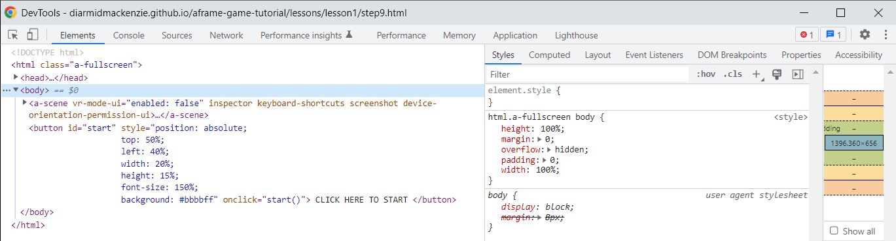
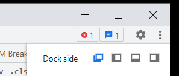
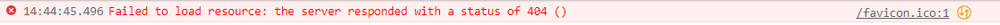
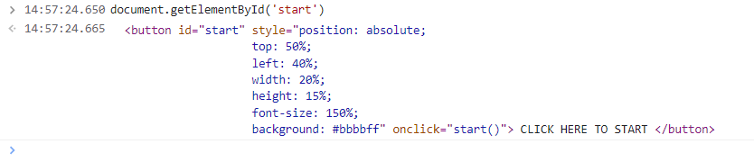
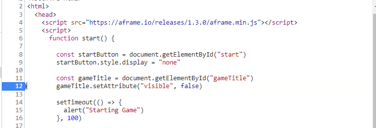
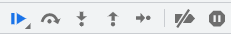
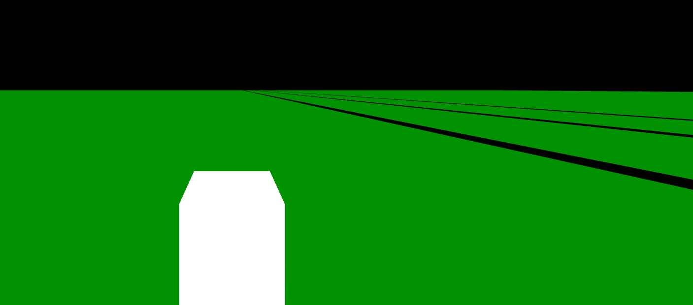
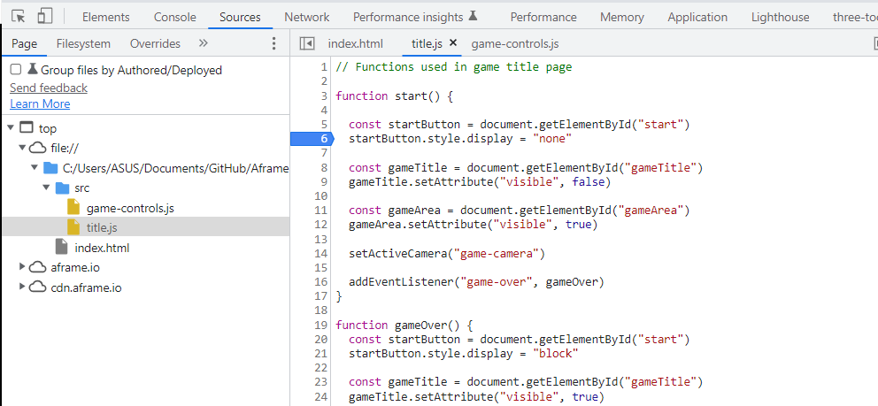
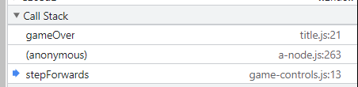
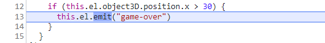

# Lesson 2 - Beginnings of a Game

In this lesson we start putting in place the beginnings of an actual game.  We're going to build a simple arcade game in the style of ["Crossy Road"](https://www.crossyroad.com/).

See this [demo](https://diarmidmackenzie.github.io/aframe-game-tutorial/lessons/lesson2/step10.html) for a preview of what we're going to get to by the end of this lesson.

Click the Mouse, or press Space Bar to advance your cute little cube safely across the (spookily empty) roads...


### This Lesson's New Tool - Chrome DevTools

Our new Tool for this lesson is the DevTools that come built into the Chrome browser (other browsers have similar, but not identical, sets of tools).  These are absolutely essential tools for developers working with HTML / JavaScript.

Open the page we built in Lesson 1 in Chrome (or this [demo](https://diarmidmackenzie.github.io/aframe-game-tutorial/lessons/lesson1/step9.html) page if you prefer)

Now press Ctrl + Shift + i on Windows, or Command + Option + i on Mac.

You should see a window that looks something like this:




Depending on your setup, this may be a separate tab, or it may be to the side of, or below the web page (squashing the web page).  You can switch between positions by clikcing the three dots on the top right, and choosing a "Dock side" option.



There's a lot of function in DevTools, and we won't slow ourselves down by going through it all now.  For now, the key things to note are:

- The "Elements" tab.

  - This shows a view of all the elements currently being rendered on the page.
  - If you dig into this you'll see that it contains all the elements in our HTML file, but it also contains a few other elements as well.
  - For example, A-Frame has added a couple of default lights to the scene, and made a few additions to the `<head>` as well. 
  - Later in this tutorial, we'll see how we can add additional elements of our own into our page, without them needing to be in our HTML.

- The "Console" tab.

  - This is where you'll find any errors hit when rendering the page.

  - You'll see there's an error in our page: 

    don't worry about this - it's not causing any problems.  The browser is just complaining that it hasn't found `favicon.ico` file, which is an image to be displayed in the browser tab)

  - It also provides a console prompt, where you can type and directly execute JavaScript.

    - Try typing `document.getElementById('start')` and you should see the command execute, and the start button element being returned, like this:

    

- The Sources tab

  - This allows you to view the source code (e.g. HTML and JavaScript) being used to generate the page.

  - You can set breakpoints, step through code line by line, and inspect the values of variables.

  - Open `step9.html` and click on line number 12 to set a breakpoint (blue arrow on the left)

    

  - Now return to the web page, click the "start" button, and the browser should jump back to DevTools, wit the code paused at line 12.

  - You can now step through the code line-by-line using these tools.

    

  - Hover your mouse over each icon to see what it does.  The last icon "pause on exceptions" can be particularly useful.  If you are seeing exceptions in your console output, activate this and your code will pause at the moment your exception is hit, helping you to understand what's going wrong.

If you want to learn more you can find the official docs [here](https://developer.chrome.com/docs/devtools/overview/), and there are many other tutorials online as well.  Or you can just play around with the tool and see what you discover.

As you follow this tutorial, you'll probably make occasional mistakes and copy code incorrectly.  If your code isn't working as you expect, DevTools can be extremely helpful in figuring out what's wrong.

### Back to writing code...

Let's get started with this lesson's new code.

We want some sort of game content to show up, when we press the "start" button.

Let's start by adding this to our HTML, inside the `<a-scene>`, after the `<a-sky>`

```
      <a-entity id="gameArea" position="0 0 -3">
        <a-box color="green">
        </a-box>
      </a-entity>
```

[Code](https://github.com/diarmidmackenzie/aframe-game-tutorial/blob/main/lessons/lesson2/step1.html) [Demo](https://diarmidmackenzie.github.io/aframe-game-tutorial/lessons/lesson2/step1.html)

This gives us a large green cube, in front of (and a little below) the camera.  For now, it's present on the title page *and* when we start the game (we'll fix that up shortly)

Here's an explanation of this code

> Here we have created two nested elements.  The outer element is an `a-entity`, with just an `id` and a `position`.  By itself, this doesn't add anything to the scene, but it's being used as a container.
>
> Within that container, we put a green `a-box` element.
>
> We don't specify a size for the box, so we get the default of 1 x 1 x 1m.  And we don't sepcify a position, so we get the default position of x: 0, y: 0, z: 0.
>
> However, because the `a-box` is nested inside the `gameArea` entity, it is positioned relative to that entity.  Because of this its actual position is x: 0, y: 0, z: -3, the same as it's parent.
>
> This nesting is useful for lots of reasons:
>
> - We can put lots of elements inside out `gameArea` element, and then re-position them all at once, just by changing one attribute on the `gameArea` element
> - We can make the `gameArea` element visible or hidden, and that setting will immediately apply to all the entities inside it.
> - We can even rotate or scale the `gameArea` element, and everything inside it will be rotated and scaled together.  We'll see this in action shortly.


### Control when the game area is visible

Now we make a couple of changes so that the game area only shows up when we start the game.

Add this additional attribute to the `gameArea` element.  This will make it's initial state be invisible.

` visible="false"`

Now, in the JavaScript in the `start()` function, add these two lines:

```
        const gameArea = document.getElementById("gameArea")
        gameArea.setAttribute("visible", true)
```

... and in the `gameOver()` function, add these two lines

```
        const gameArea = document.getElementById("gameArea")
        gameArea.setAttribute("visible", false)
```

[Code](https://github.com/diarmidmackenzie/aframe-game-tutorial/blob/main/lessons/lesson2/step2.html) [Demo](https://diarmidmackenzie.github.io/aframe-game-tutorial/lessons/lesson2/step2.html)

Now, the game area is shown when the game starts, and hidden again

> The techniques used here are just the same as we used in Lesson 1 to hide and show the `gameTitle` element.


### Developing the Game Area

Now that we have the game area appearing and disappearing at appropriate times, let's build out an area where we could actually play a game.

Replace the single `a-box` inside the `gameArea` element with the following lines:

```
		<a-box color="green" position="0 -1 0" width="500" depth="500">
        </a-box>
        <a-box color="white" position="0 0 0">
        </a-box>
        <a-box color="black" position="10 -0.99 0" width="1" depth="500">
        </a-box>
        <a-box color="black" position="20 -0.99 0" width="1" depth="500">
        </a-box>
        <a-box color="black" position="30 -0.99 0" width="1" depth="500">
        </a-box>
```

What this gives us is:

- A large flat play area (500m x 500m)
- A single white cube, which is our avatar (for now - we'll give it a bit more personality later!)
- Three black strips representing roads to cross.

[Code](https://github.com/diarmidmackenzie/aframe-game-tutorial/blob/main/lessons/lesson2/step3.html) [Demo](https://diarmidmackenzie.github.io/aframe-game-tutorial/lessons/lesson2/step3.html)

In your browser, you should see something like this:



Some notes on the code:

> The green box has no specified height, which means that it's height is 1m.  By positioning this at y = -1, the surface sits at -0.5m, so a 1m cube positioned at y = 0 sits exactly on the surface
>
> The black roads are boxes with a height and width of 1m, but a depth of 500m, meaning that they cross the entire play area.
>
> Positioning them at y = -0.99, means that the top of the box (the "road surface") is just a touch above the green play area.  This helps us to avoid a phenomenon known as "z-fighting" where two surfaces rendered in exactly the same position end up alternating which one is closest to the camera, which results in really messy visuals.
>
> There are other ways of managing z-fighting, but this is a nice & simple one.


### Fixing the Camera Angle

For our Crossy Road-style arcade game, we want a very different camera angle, with the camera pulled back and above the action.

However, we also need to consider the spinning text on our title screen - we want to keep the angle there the same.

There's a few ways we could solve this, but a simple one is to have two different camera, and change which one is active, depending on whether we are on the title screen or in the game.


In our HTML, make the following changes

- For the existing camera, add an `id` attribute: `id:title-camera`

- Add another camera, in between `<a-sky>` and the `gameArea` element:

  ```
  <a-entity id ="game-camera" position="0 50 80" camera="active:false; fov:30" rotation = "-25 -10 0"></a-entity>
  ```

- Adjust the `gameArea` entity itself to this (removing the `position` attribute and adding a `rotation` attribute)

  ```
  <a-entity id="gameArea" rotation="0 60 0" visible="false">
  ```

This gives us our new camera, and makes each ofthe cameras easily identifiable.

Now, in our JavaScript code

- add the following function:

  ```
        function setActiveCamera(id) {
          const cameras = document.querySelectorAll("[camera]")
          cameras.forEach((c) => {
            if (c.id === id) {
              c.setAttribute("camera", "active", true)
            }
            else {
              c.setAttribute("camera", "active", false)
            }
          })
        }
  ```

- Inside the `start()` function add this line:

  ```
  setActiveCamera("game-camera")
  ```

- inside the `gameOver()` function, add this line:

  ```
  setActiveCamera("title-camera")
  ```

[Code](https://github.com/diarmidmackenzie/aframe-game-tutorial/blob/main/lessons/lesson2/step4.html) [Demo](https://diarmidmackenzie.github.io/aframe-game-tutorial/lessons/lesson2/step4.html)

We now have a new camera, positioned above & pointing down at the game area.  The game area itself is rotated at an angle.  And we switch to the new camera when the game starts, and away from it when the game ends.

There's quite a bit to explain here.  Let's start with the camera...

> First, the new camera
>
> - We've set this at a position 50m above, and 80m backwards from the play area.
> - We've pointed it downwards at an angle of 25 degrees, and also to the right at an angle of 10 degrees, resulting in our avatar being somewhat towards the bottom left of the camera.
> - We've also zoomed the camera in by adjusting the camera field of view (fov) from 80 degrees to just 30 degrees.
>
> For the play area itself:
>
> - Now that we're using a dedicated camera for the game area, there's no need to adjust its position - we can just have it at x: 0, y: 0, z: 0 and position the camera exactly where we want it.
> - We've rotated the play area by 60 degrees, so that play proceeds diagonally.
>
> Note that we *could* have achieved the same effect leaving the play area position unchanged, and moved the camera to the side and changing the angle.  In my view it's easier to think about turning the play area and positioning and tilting the camera in just 2 dimensions, than to think about repositioning the camera in all 3 dimensions.
>
> It's quite common for there to be more than one way to achieve a particular visual effect, and usually the one that you find easiest to visualize and reason about will prove to be the simplest to implement and maintain.


Having set up the camera, we need to switch cameras at the appropriate time.  Let's now look at how that code works...

>
> Both the `start()` and `gameOver()` functions need to switch camera, but we can avoid duplicating the code by making a new function `setActiveCamera` that can be called from both places.
>
> The `setActiveCamera` function has to do 2 things:
>
> - it must set the desired camera to `active`
> - it must set the other camera to `inactive`.
>
> Our code implements this by setting *all other camera* to inactive - which means it won't need to be changed if we add a 3rd camera in future.
>
> Let's look at this line -by-line, as this code introduces a few new concepts:
>
>     const cameras = document.querySelectorAll("[camera]")    
>
> `document.querySelectorAll` is similar to `document.getElementById` except that
>
> - it uses a "selector" rather than an `id`
> - it returns all matching elements, rather than just one.
>
> There are various different kinds of selector, and here we've used the ["Attribute selector"](https://developer.mozilla.org/en-US/docs/Web/CSS/Attribute_selectors) , indicated by square brackets `[]`, which will select all elements in the page that have a particular attribute.  In this case, we're looking for every element with a `camera` attribute.
>
> Selectors are described in full [here](https://developer.mozilla.org/en-US/docs/Web/CSS/CSS_Selectors)
>
> `document.querySelectorAll` doesn't return an element.  Instead it returns a ["NodeList"](https://developer.mozilla.org/en-US/docs/Web/API/NodeList)  of elements, which you can think of as just an ordered list of these elements.  JavaScript provides built-in functions to do various useful operations on NodeLists.
>
> ```
> cameras.forEach((c) => {
>   ...
> })
> 
> ```
>
> One such useful function is `forEach` which executes a given function for each member of the array in turn.
>
> `forEach()` has just one argument, which is itself a function,  just like `setTimeout()`, which we saw in Lesson 1.
>
> But unlike `setTimeout`, the supplied function itself has an argument, which is filled with each member of the array in turn.  To refer to the array member inside the function, we need to give this a name.   We can pick any value here - I chose `c` , but could have chosen `cam`, `camera` or any other name I liked.
>
>
> ```
>   if (c.id === id) {
>    c.setAttribute("camera", "active", true)
>   }
>  else {
>     c.setAttribute("camera", "active", false)
>  }
> ```
>
> Finally, this is the code we execute for each member of the array
>
> The `if...else...` construct in JavaScript evaluates an expression, and evaluates one or other branch of code (delimited by `{ }` ) depending on whether the express is true or false.
>
> So as we work through each member of the array`c.id` is the camera we are considering right now.  If this has an `id` that matches the `id` we want to make active, we set the `"active"` property on the `"camera"` attribute to `true`.  If not, we set it to `false`
>
> Note that the same thing could have been achieved with a single line of code:
>
> ```
> c.setAttribute("camera", "active", (c.id === id))
> ```
>
> This code simply evaluates the expression `(c.id === id)` and sets the `"active"` property on the `"camera"` attribute to that value, whether that is true or false.  Exactly the same as the code above, but perhaps a little harder to understand as a beginner (and maybe harder to debug as you can't se breakpoints so easily).
>
> Finally, note that the comparison uses a *triple* `=` sign (`===`).  Comparisons in JavaScript usually use a triple `=` sign (`===`), which tests for ["strict equality"](https://developer.mozilla.org/en-US/docs/Web/JavaScript/Reference/Operators/Strict_equality).  If you are curious, you can find a detailed explanation of this [here](https://www.freecodecamp.org/news/javascript-triple-equals-sign-vs-double-equals-sign-comparison-operators-explained-with-examples/#:~:text=Double%20Equals%20(%20%3D%3D%20)%20checks%20for,does%20not%20perform%20type%20coercion.), but for now it's enough to remember to use a triple equals (`===`) in comparison tests.
>
> Most importantly, take care *never* to use a single `=` in comparison expressions - **it won't work!**  A single `=` always results in an assignment:  `c.id = id` will not *test* whether `c.id` and `id` are equal, instead it will *set* the value of `c.id` to whatever the value of `id` is.


### Some Housekeeping

With all that added code, our HTML file is starting to get a bit large.  Time to so a bit of tidying!

In the same folder as your `index.html` file, create a new directory called `src`

Within this directory, create a new file called `title.js` and copy into it all of the code that's within the second `script` element in the document `head`.

At the top of this file, insert the following line:

````
// Functions used in game title page
````

Now, back in your HTML file, replace the previous `script` element with this:

```
<script src="./src/title.js"></script>
```

The functionality of the game should be unchanged from before, but the code is now better organized, which will make things easier to manage going forwards.

[Code](https://github.com/diarmidmackenzie/aframe-game-tutorial/blob/main/lessons/lesson2/step5.html) [Demo](https://diarmidmackenzie.github.io/aframe-game-tutorial/lessons/lesson2/step5.html)

Some notes on these changes:

> We often refer to text files that contain code as "modules".  In general it's good practice to avoid any one module from becoming too large, and to ensure that each module has a clearly defined overall purpose.
>
> We can use HTML's ability to import JavaScript using `script`elements to spread our code out across multiple modules, each focussed on a specific aspect of our game or webpage.
>
> The line beginning `//`is a comment line.  This line is not executed, and removing it would have no ill effects.  The reason to include it at the top of the `title.js` module is to provide a quick summary of the content of this module.
>
> Adding comments to your code can be very useful for people reading and maintaining your code, and you may also find them useful yourself, especially when you come back to look at your code again weeks, months or even years later, and it's no longer fresh in your mind.
>
> However too much reliance on comments can be a bad thing.
>
> - Always try to use clear and explicit function names and variable names, to make it clear what they each do.
> - Break complicated code up into simple sub-functions (and give these clear and explicit names as well).
> - Having made your code itself as expressive as possible, use comments to explain things that still aren't clear.  Often the most useful comments are those that ad broader context, or explain why a particular approach was used, rather than alternatives.
>
> A few key problems with over-commented code are:
>
> - Comments are used to mask the fact that the code itself is not as expressive as it could be.
> - People reading the code (including you!) can be drawn into reading the comments rather than the code itself, and failing to spot that the code doesn't actually implement what the comments describe.
> - When code changes, comments can become outdated, so that they no longer match the code.  This can lead to confusion in the future.


### Basic Controls

It's finally time to add some controls to our game.

We'll set things up so that each mouse click advances our cube forwards by 1m.

In the `src` directory, create a new module called `game-controls.js`, and paste the following code into it.

```
AFRAME.registerComponent('game-controls', {

  init() {

    this.stepForwards = this.stepForwards.bind(this)
    window.addEventListener("click", this.stepForwards)
  },

  stepForwards() {
    this.el.object3D.position.x += 1
  }
})
```

In the `head` of `index.html`, add the following line.

```
<script src="./src/game-controls.js"></script>
```

And on the white `a-box`, add the following additional attribute:

`game-controls`

Finally, in `title.js`, remove these lines - now that we are building some actual gameplay, we don't need these any more:

```
  setTimeout(() => {
    alert("Starting Game")
  }, 100)

  setTimeout(() => {
    gameOver()
  }, 3000)
```

[Code](https://github.com/diarmidmackenzie/aframe-game-tutorial/blob/main/lessons/lesson2/step6.html) [Demo](https://diarmidmackenzie.github.io/aframe-game-tutorial/lessons/lesson2/step6.html)

With each mouse click, the white cube avatar advances one space.

However, since we removed the only code that called the `gameOver()` function, the game now never ends.  We'll fix that shortly.  For now, you can refresh the browser (F5 key) to get back to the title menu.

Let's explain this new code:

> Up until now, all the attributes that we have set onto our elements have been pre-existing attributes.  However A-Frame gives us the ability to define our own custom attributes, and this is what we are using here.
>
> We've defined a new attribute called `game-controls` and assigned it to the white cube.  This `game-controls` attribute moves the element it is applied to 1 unit forwards in the x direction, on every mouse click.
>
> Custom attributes in A-Frame are known as "components".
>
> Let's clarify the terminology here.
>
> A-Frame implements a software architecture pattern called "Entity Component System" (ECS).  This is a common pattern for game development.  For example, it's used by both Unity and Unreal Engine, the two most popular game development engines.
>
> In the ECS pattern, games (or other experiences) are made up of a number of different "entities" (the player, enemies, floor, walls, vehicles, bullets etc.), each of which has a range of components that determine its characteristics and behaviour.  These "components" can be anything from it's position and orientation, to its health/damage, its physical appearance, whatever determines it s movement (controller, AI or NPC scripts) and so on.
>
> Running in the web browser, A-Frame's version of ECS implements entities as HTML elements, and components as HTML attributes.
>
> So when we want a `game-controls` *component*  on our player *entity*, we do this by setting a `game-controls` *attribute* onto the player HTML *element*.
>
> Now, let's see how this new component actually works...
>
> Working backwards, the component includes a function called `stepForwards()`.  This increases the entity's x position by 1 unit, using this line of code.
>
> ```
> this.el.object3D.position.x += 1
> ```
>
> There's a lot to unpack here, let's start with the easy bits...
>
> -  `foo += 1` is a JavaScript shorthand for `foo = foo + 1`
> - `this` is a special JavaScript keyword that refers to the current context.  Within an A-Frame component, `this` refers to the component, and `this.el` refers to the element that the component is configured on.
>
> What about this bit?
>
> ```
> object3D.position.x
> ```
>
> Based on what we've done before, you might expect us to do something like this:
>
> ```
> const pos = this.el.getAttribute("position")
> pos.x += 1
> this.el.setAttribute("position", pos)
> ```
>
> We could do that, and it should work just as well.  However for updates to position, A-Frame [recommends](https://aframe.io/docs/1.3.0/components/position.html#updating-position) direct manipulation of the `object3D` property, as it requires less code, and it performs better (i.e. uses fewer CPU cycles).
>
> So what's an `object3D`?
>
> A-Frame is built on top of another JavaScript library called THREE.js.  `Object3D` is a class of object provided by THREE.js to represent any entity in 3D space that has a position, a rotation, a scale etc.
>
> Every A-Frame entity has an `Object3D` that tracks its position, rotation and scale, together with its position in the scene graph (i.e. its parent and children), and various other basic properties.  This is always accessible via the `object3D` property on the element.
>
> When the HTML `"position"` (or `"rotation"` or `"scale"`) attribute is set on an element representing an A-Frame entity, A-Frame applies this change to the `object3D`.  However, JavaScript code can also update these properties directly, and tis is in fact [the recommended approach](https://aframe.io/docs/1.3.0/components/position.html#updating-position).
>
> You can find the reference documentation for the THREE.js Object3D [here](https://threejs.org/docs/index.html?q=object3D#api/en/core/Object3D), including all its properties.  However there's no need to dig into this much detail yet (and it would probably be overwhelming to do so).  We'll introduce other aspects of the Object3D as we need them.

OK - so we've understood how the `stepForwards()` function works.  Let's look at the rest of the component.

> The other key part of the component is the `init()` function
>
> ```
>   init() {
> 
>     this.stepForwards = this.stepForwards.bind(this)
>     window.addEventListener("click", this.stepForwards)
>   },
> ```
>
> `init` is a special reserved function name for A-Frame components (there are a few others as well, which we'll see later)
>
> `init()` is called when the component is initialized (i.e. when the attribute is added to the HTML element)
>
> At this point, we need to do just two things.
>
> - We "bind" `this` as the context for the  `stepForwards()` function.  Don't worry too much about this, as it's a little subtle.  As we saw above, in `stepForwards()` we want to be able to access the component using the keyword `this`.  This "bind" operation is necessary for that to work.
> - We listen for the "click" event on the "window", calling `this.stepForwards()` every time this event is detected.


### Ending the Game

Let's add an ending to our game.  In the long-run, we want the game to be an endless runner, but until there's some hazards that can end the game for our player, let's bring it to an end when he has crossed all three roads...

We'll do this in a way that introduces one new key concept: "custom events".

We've just seen the "click" event, which is a built in event that's generated whenever the mouse button is clicked.

We can also define our own events, which we can use for any purpose we like.  This can be a convenient way to communicate cleanly between separate pieces of code.

In the `start` function in `title.js`, add this line:

```
addEventListener("game-over", gameOver)
```

And at the end of the `stepForwards` function in `game-controls.js`, add this line:

```
if (this.el.object3D.position.x > 30) {
   this.el.emit("game-over")
}
```

Now the player can advance, and the game ends after they cross the 3rd road.

[Code](https://github.com/diarmidmackenzie/aframe-game-tutorial/blob/main/lessons/lesson2/step7.html) [Demo](https://diarmidmackenzie.github.io/aframe-game-tutorial/lessons/lesson2/step7.html)

Some notes on this code:

> We've used a new custom event, "game-over".  Custom events don't need to be explicitly defined - you can use pretty much any name you like for an event.
>
> You listen for the event using `addEventListener`, and generate the event by using `emit`
>
> Events can be emitted on any A-Frame element.  They can also be listened for on any element, or on the whole browser window.  When an event is emitted it "bubbles up" through the HTML element hierarchy, so it can be detected on any element that is higher up in the hierarchy.
>
> So `this.el.addEventListener` would listen for an event only on this particular element (or one of its children), whereas `addEventListener` listens on the whole window (meanign it will detect the named event wherever it is emitted).
>
> The `emit` function is provided by A-Frame, and can only be used by A-Frame elements.
>
> However for other HTML elements, you can do the same thing with just a couple of lines of code:
>
> ```
> const myEvent = new CustomEvent("event-name")
> myElement.dispatchEvent(myEvent)
> ```
>
> You can find detailed documentation of JavaScript Events [here](https://developer.mozilla.org/en-US/docs/Learn/JavaScript/Building_blocks/Events), but the brief explanation above should be enough for now - we'll introduce more about Events as needed.

### Reset Game State

We can now start the game from the title screen, play it through, and return to the title screen again.

But if you then play the game a second time, without refreshing the browser, you can't start again.

You may be able to guess why this is, but let's use this to show how to use the browser DevTools to debug a problem...

- Play through the game once and get back to the title screen
- Now click the "start" button again.  The game seems not to start.
- Open DevTools, got to the "Sources" tab, and open title.js.  Add a breakpoint inside the `start` function by clicking on one of the line numbers:




- Now press the start button again.  You should jump back into the debugger, with program execution paused at the breakpoint.

So we can see that the `start` function is being called a 2nd time (as expected), so why does the game not start?

We know the `start` function hides the title screen.  Yet the title screen doesn't get hidden.  The only possible explanation is that it's being shown again immediately.  So perhaps the `gameOver` function is being called immediately after the `start` function?

- Remove the breakpoint in `start` and add one into `gameOver`, then hit the "start" button again.

- You'll see program execution stop at your breakpoint.

- So we are callign the `gameOver` function immediately after the `start` function (it happens so fast that we don't even see the game screen pop up).

- Why?

- To the right of the "Sources" tab, you'll see a line labelled "Call Stack".  Click on this, and you'll be able to see where the `gameOver` function was called from.

  

- Click on the "stepForwards" line, and we can see that we're inside a branch of code that's only supposed to happen when the player's x position is > 30.

  

If you didn't work it out before, hopefully now you can figure out what's happening....

When we play the game, our avatar's position increases from 0 to 30, until we hit "game over".  But we never reset the position back to 0.  So when we play the game again, we immediately trigger this condition, and go straight back to "game over" processing.

The fix is fairly simple.

- At the end of `title.js` add the following new function:

```
function initializeGameState() {

  const player = document.getElementById("player")
  player.object3D.position.set(0, 0, 0)

}
```

- And inside the `start` function, include a line to invoke this new function

```
initializeGameState()
```

Now, every time we start the game, we reset the player's position to (0, 0, 0), meaning the player makes a fresh start, and gets to play the game again.

[Code](https://github.com/diarmidmackenzie/aframe-game-tutorial/blob/main/lessons/lesson2/step8.html) [Demo](https://diarmidmackenzie.github.io/aframe-game-tutorial/lessons/lesson2/step8.html)

### Keyboard Controls

Next, we're going to add some alternative controls, so that the player can also be advanced forwards by pressing the space bar.

Make the following changes to `game-controls.js`

Inside `init()` add the following two lines:

```
this.keyDown = this.keyDown.bind(this)
window.addEventListener("keydown", this.keyDown)
```

And add the following function definition. 

```
keyDown(event) {

  if (event.key === " ") {
    this.stepForwards()
  }
}
```

Note that you will also need to add a comma (`,`) between the `stepForwards` and `keyDown` functions (this is just the way that `AFRAME.registerComponent` works: i's second argument is a JavaScript Object representing the component, where all the supplied properties need to be comma-separated).

With this change, you should be able to move the avatar forwards using the space bar.

[Code](https://github.com/diarmidmackenzie/aframe-game-tutorial/blob/main/lessons/lesson2/step9.html) [Demo](https://diarmidmackenzie.github.io/aframe-game-tutorial/lessons/lesson2/step9.html)

To explain this code...

> We're using a new built-in JavaScript event, `keydown`.  The [`keydown` event](https://developer.mozilla.org/en-US/docs/Web/API/Element/keydown_event) has several different properties, one of which is an indication of which key was pressed, available in the `key` property.
>
> So when the keydown event is detected, we just need to check whether the key pressed is the one we care about.  If it is, we do exactly the same as we do with the "click" event, and call the `stepFowards` function.
>
> We previously introduced the `if...else` construct.  Here, we have an `if` without an `else`.  This does exactly what you would expect - it's just like `if...else`, but with an empty `else` branch.

### Filter Repeats

We have one last bug to fix.

Start the game and hold down the space bar.  After a brief pause, the avatar sets off at a very fast pace.

What's happening here is that when a key is held down, the keydown event starts to fire repeatedly.  The exact delay and rate will be set up in your Operating System, but this isn't a behaviour we want in our game.

Fortunately it's easy to fix.

The `keydown` event has another property named `repeat` which is set to `false` on the initial key press, and set to `true` on these repeats of the event, which don't correspond to real key presses.

To fix our code, we just need to modify this line:

```
if (event.key === " " {
```

to read

```
if (event.key === " " && !event.repeat) {
```

[Code](https://github.com/diarmidmackenzie/aframe-game-tutorial/blob/main/lessons/lesson2/step10.html) [Demo](https://diarmidmackenzie.github.io/aframe-game-tutorial/lessons/lesson2/step10.html)

Explaining this code...

> We're using two new logical operators here, && (AND) and ! (NOT)
>
> Logical operators are extremely useful when constructing expressions to use in `if` tests (and plenty of other contexts).
>
> The [NOT operator](https://developer.mozilla.org/en-US/docs/Web/JavaScript/Reference/Operators/Logical_NOT) `!` just swaps over `true` & `false`
>
> The [AND operator](https://developer.mozilla.org/en-US/docs/Web/JavaScript/Reference/Operators/Logical_AND) `&&` results in a `true` value only if *both* the linked expressions are `true`
>
> So in this case, we will move forward if the key pressed is a space, *and* the key press is not a repeat.
>
> A comprehensive reference on expressions and operators can be found [here](https://developer.mozilla.org/en-US/docs/Web/JavaScript/Reference/Operators) - but there's a huge amount of detail there that it's probably better not to worry about right now.
>
> For now the one other key operator to get comfortable with is the [OR operator](https://developer.mozilla.org/en-US/docs/Web/JavaScript/Reference/Operators/Logical_OR) `||` (that's two "pipe" characters), which results in a `true` value if *either* (or both) of the linked expressions is `true`.


### Recap

We now have the very simple beginnings of a game behind our title screen.

In building this, we've made use of a range of additional new HTML and JavaScript concepts.

- Building up a 3D scene using the `a-box` element, with various different widths, depths and colors.
- Nesting of HTML elements, and how the positioning of a parent element influences the positioning of a child element.
- Switching between active cameras
- Adjusting the position, rotation and field of view of a camera
- Using `querySelectorAll` and iterating through the results using `forEach`
- `if...else`
- The Entity-Component-System architecture used by A-Frame, and how this maps to HTML elements and attributes
- Modifying the position of 3D elements using `object3D.position`
- Listening to and emitting custom events
- The `keydown` event, and how to handle it, including repeats

We've also gained some familiarity with using Chrome DevTools for debugging.

We now have a lot of the building blocks that we'll need to build out a functional (and hopefully fun!) little game.

Next lesson, we'll get some traffic running on our roads, so that our little avatar has something to dodge!


