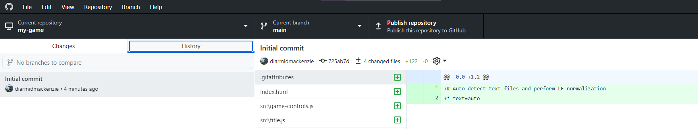

# Lesson 3 - Vehicles & Collisions

In this lesson we add vehicles to the roads, and put some collision detection in place.

See this [demo](https://diarmidmackenzie.github.io/aframe-game-tutorial/lessons/lesson3/step9/index.html) for a preview of what we're going to get to by the end of this lesson.

Click the Mouse, or press Space Bar to advance your cute little cube safely across the roads, taking care to avoid the vehicles...


### This Lesson's New Tool - GitHub Desktop

I'm going to introduce version control using Git and GitHub Desktop.

#### What is Git?

Git is a distributed version control system.

You can think of version control as like a "save game" option when you are coding.  But it's super-powerful, so you get a history of your progress from one save point to the next, and you can create multiple branches from a particular save point, and then merge them together later.

The fact that Git is a *distributed* version control system means that it's great for collaboration.  Multiple users can make their own sets of changes from a particular point in a project history, and then merge them together later.

Git was first developed by Linux Torvalds (the creator of Linux) in 2005, and it's now pretty much *the* standard tool for version control.

#### What is GitHub Desktop?

GitHub Desktop is a desktop client application that makes it easy to use Git for version control.

It has integration with GitHub, which is a free service that can be used to save and publish your code online, but can be used for local version control using Git even if you don't use GitHub.

You can install GitHub Desktop here:

https://desktop.github.com/


#### Creating your first Repository

A **repository** (or **repo**) is the term used for a project that is under version control.

You can convert the code you have already written into a repository using the menu option File\New repository...


Fill in the name (which should match the name of the folder that your code is in), description etc. and the path to your code (not including the final folder that's in the 	"Name" field), and click "Create repository".


You should see something like this:


Switch to the "History" tab, and you should see your code has been added to the repository with the comment "Initial commit"



You can explore this commit in the panel on the right.

Added lines are green, unchanged lines are white, and removed lines are red.  In this case, all the lines are green as they have just been added.

We're learn more about how to use GitHub Desktop as we work through this lesson.

Before we start coding, let's create a new branch for our work this lesson.  We'll do all our work on this branch, and when we complete the lesson, we'll merge it all back onto the main branch (called "main")

From the menu choose Branch / New branch..., and create a branch called "lesson3"


We're now working on a new branch, called lesson3


### On with the coding...

We'll start by adding some vehicles onto our roads.

Create a new module in the `src` folder, called `vehicles.js` with the following code:

```
AFRAME.registerComponent('road', {

  schema: {
    numVehicles: { type : 'number', default: 10},
    speed: {type: 'number', default: 3},
  },

  init() {
    this.vehicles = []

    for (var ii = 0; ii < this.data.numVehicles; ii++) {
      const vehicle = this.createVehicle(ii)
      this.vehicles.push(vehicle)
    }
  },

  createVehicle(index) {
    const roadLength = this.roadLength()
    zPosition = (Math.random() * roadLength) - (roadLength / 2)

    const vehicle = document.createElement('a-box')
    vehicle.setAttribute("depth", 2)
    vehicle.setAttribute("id", `${this.el.id}-vehicle-${index}`)
    vehicle.setAttribute("color", "blue")
    vehicle.object3D.position.set(0, 0.5, zPosition)
    this.el.appendChild(vehicle)

    return vehicle
  },

  roadLength() {
    return this.el.getAttribute("depth")
  }
})
```

Now, in `index.html`, add the following line to the `head`:

```
    <script src="./src/vehicles.js"></script>
```

And modify the HTML for our roads to the following (adding a `road` component to each of our roads)

```
        <a-box color="black" position="10 -0.99 0" width="1" depth="500" road="numVehicles: 10; speed: -10">
        </a-box>
        <a-box color="black" position="20 -0.99 0" width="1" depth="500" road="numVehicles: 10; speed: -12">
        </a-box>
        <a-box color="black" position="30 -0.99 0" width="1" depth="500" road="numVehicles: 10; speed: 14">
        </a-box>
```

[Code](https://github.com/diarmidmackenzie/aframe-game-tutorial/blob/main/lessons/lesson3/step1) [Demo](https://diarmidmackenzie.github.io/aframe-game-tutorial/lessons/lesson3/step1/index.html)

With these changes, we should see some vehicles (for now, they are just blue rectangles) distributed on our roads:


There's quite a lot of new code here - let's explain it...

> ```
> AFRAME.registerComponent('road', {
> ```
>
> Just like in our last lesson, we are creating a new component.  This one is called `road`
> 
>
> ```
> schema: {
>     numVehicles: { type : 'number', default: 10},
>     speed: {type: 'number', default: 3},
>   },
> ```
>
> This defines the "schema" for our new component.
>
> This defines the individual properties that can be set within the attribute.  For each property we give it a name, a type (e.g. is it a number, a text string etc?) and, optionally, a default value to use if no value is specified.
>
> A full description of schemas for A-Frame components can be found [here](https://aframe.io/docs/1.3.0/core/component.html#schema)
>
> ```
>   init() {
>     this.vehicles = []
> 
>     for (var ii = 0; ii < this.data.numVehicles; ii++) {
>       const vehicle = this.createVehicle(ii)
>       this.vehicles.push(vehicle)
>     }
>   },
> ```
>
> The `init` function is called when the component is initialized.
>
> This function starts by creating an empty Array (an array in JavaScript is an ordered list of objects), which is stored in this component instance as `this.vehicles`.
>
> The `for` line creates a loop which we will execute once for each vehicle that we want on the road.  Javascript for loops are explained in detail [here](https://developer.mozilla.org/en-US/docs/Web/JavaScript/Reference/Statements/for).
>
> Looking at the 3 clauses inside the `for` declaration...
>
> ```
> var ii = 0
> ```
>
> This is our initialization.  It happens once, when the `for` loop is first executed.  We create a new variable called `ii`, and set it to 0.
>
> ```
> ii < this.data.numVehicles
> ```
>
> This is our condition.  We loop as long as this condition is met - i.e. until we have added the correct number of vehicles.  Note that all the data in the component's schema is accessible from within the component in the object `this.data`, so `this.data.numVehicles` contains the value passed into the component for the `numVehicles` property.
>
> ```
> ii++
> ```
>
> This is our "afterthought" - this gets executed after each iteration through the loop.
>
> The body of the loop itself invokes a function on this component `this.createVehicle`.  Then the object returned from `this.createVehicle` is "pushed" into our `this.vehicles` array.  Pushing an item onto an array just means adding it to the end of the list.
>
> Now, let's look at what `this.createVehicle()` actually does.
>
> ```
>     const roadLength = this.roadLength()
>     zPosition = (Math.random() * roadLength) - (roadLength / 2)
> ```
>
> First, we set up a couple of bits of information we'll need to create the vehicle.
>
> - we get the length of the road (using yet another function, which we'll look at shortly)
> - we pick a random point along this road.  `Math.random()` will give us a random number between 0 and 1.  We scale and adjust this to get a random number between `-(roadLength / 2)` and `(roadLength / 2)`

> ```
>  const vehicle = document.createElement('a-box')
>  vehicle.setAttribute("depth", 2)
>  vehicle.setAttribute("id", `${this.el.id}-vehicle-${index}`)
>  vehicle.setAttribute("color", "blue")
>  vehicle.object3D.position.set(0, 0.5, zPosition)
>  this.el.appendChild(vehicle)
> ```
>
> This code:
>
> - creates a new HTML Element using [`createElement`](https://developer.mozilla.org/en-US/docs/Web/API/Document/createElement)...
> - ...sets various attributes on it...
> - ...and adds it to the graph of HTML Elements as a child of `this.el` (i.e. whichever element the `road` attribute is set on)
>
> Whenever you create an element, it's essential to add it to the graph of HTML Elements using [`appendChild`](https://developer.mozilla.org/en-US/docs/Web/API/Node/appendChild), or it won't actually be instantiated within the page.
>
> So the code effectively inserts the following HTML into the page for each vehicle:
>
> ```
> <a-box depth=2; id="xxx-vehicle-xxx"; color="blue"; position="0 0.5 xxx">
> </a-box>
> ```
>
> But note that the specific values used in the `xxx`placeholders can be determined dynamically in code, whereas if we wrote this in an HTML file, we'd need to know in advance what values to set.
>
> A brief not on this code:
>
> ```
> `${this.el.id}-vehicle-${index}`
> ```
>
> The \` character is JavaScript is used to compose strings out of a mix of text and variable values.  The `${variable}` syntax is used to insert the value of a variable into a string.
>
> You could achieve the same thing using `+` to concatenate (i.e. join together) strings, like this:
>
> ```
> this.el.id + "-vehicle-" + index
> ```
>
> But the syntax using \` and `${variable}` is considered more readable and more modern, so it's preferable in most cases.
>
> ```
>  return vehicle
> ```
>
> The last line of code in `this.createVehicle()` returns the `vehicle` object created, so that it can be used by the calling code.  As we saw, the calling code pushes this object onto an array of vehicles.
>
> The final bit of code to explain is this:
> ```
>   roadLength() {
>     return this.el.getAttribute("depth")
>   }
> ```
>
> This is a simple function to get the length of the road.  It extracts the `depth` attribute from the element, and uses that as the road length.
>
> Rather than having a function here, we could have simply written the following line within `createVehicle`
>
> ` const roadLength = this.el.getAttribute("depth")`
>
> The reason for breaking this out into a separate function is that by pulling this detail out into a separate function, we simplify `createVehicle` , making it easier to read and understand, without complicating it with the additional detail about how we figure out the length of the road.


### Checking in our changes

Switch back to GitHub Desktop, and you should see a display of all the changes that you have made.


The panel on the left shows each of the files you have modified, and when you select a file, the panel on the right shows the changes you have made.

Check through these changes to make sure they match what you expected.  It's worth testing your code at this point too, to make sure that it is also *doing* what you expected.

Now you are ready to make your first check-in.

In the bottom left, fill in a summary of your check-in, and a brief description of your changes, and press the "Commit" button.    The description is optional, but information that you add here can be very useful later in figuring out what you were thinking when you made a particular change.


When you hit "Commit", you'll see that the repository no longer shows any changed files, but you now have an additional check-in in your History tab.


Going forwards, you should check in your changes at the end of each step.

### Making the vehicles move

We've configured a speed for the vehicles on each road, but they aren't actually moving yet.

To make them move, we make some more changes to  `vehicles.js`

At the end of the module, we define a new component, `z-movement`

```
AFRAME.registerComponent('z-movement', {

  schema: {
    speed: {type: 'number', default: 3},
  },

  tick(time, timeDelta) {

    const delta = this.data.speed * timeDelta / 1000
    this.el.object3D.position.z += delta
  }
})
```


And when we create the vehicles, we set `z-movement` to the appropriate value:

```
vehicle.setAttribute("z-movement", {speed: this.data.speed})
```

[Code](https://github.com/diarmidmackenzie/aframe-game-tutorial/blob/main/lessons/lesson3/step2) [Demo](https://diarmidmackenzie.github.io/aframe-game-tutorial/lessons/lesson3/step2/index.html)

Now check in these changes.

Some notes on this code...

>  We've created another new component here.  This one is responsible for driving movement on the z-axis at a fixed speed.
>
>  We could have done this using the `animation` component, but the looping behaviour that we want (coming next) would be a bit fiddly to do in that way, so we've built our own very simple component to handle the z-axis movement.
>
>  The new concept here is the `tick` function.  This is a special function on an A-Frame component that is called every single frame.  It has two parameters, the current time, and the time since it was last called.  These are useful because the rate at which the `tick`function is called may vary depending on what else is going on in the system.  We can use the information in these parameters to ensure that movement occurs at a uniform speed, even if the frame rate is variable.
>
>  In this case, we take the time since the last frame (in milliseconds), divide by 1000 to get this time in seconds, and multiply it by the desired speed, to determine the amount to move the entity by on this frame.


### Looping the vehicles

The vehicles now move, but they just continue in one direction forever, so after a time, our play area becomes empty again.

Let's fix this so that when they reach the edge of the play area, the vehicles loop round to the start again.

Add two additional values to the `z-movement` schema:

```
    loopLower: {type: 'number', default: -100},
    loopUpper: {type: 'number', default: 100},
```


Extend the `tick` processing in `z-movement` to include the following:


```
    const loopLength = this.data.loopUpper - this.data.loopLower

    if (this.el.object3D.position.z > this.data.loopUpper) {
      this.el.object3D.position.z -= loopLength
    }

    if (this.el.object3D.position.z < this.data.loopLower) {
      this.el.object3D.position.z += loopLength
    }
```

And finally, include values for the two new schema properties where we set `z-movement`:

```
    vehicle.setAttribute("z-movement", {speed: this.data.speed,
                                        loopLower: -roadLength/2,
                                        loopUpper: roadLength/2})
```

[Code](https://github.com/diarmidmackenzie/aframe-game-tutorial/blob/main/lessons/lesson3/step3) [Demo](https://diarmidmackenzie.github.io/aframe-game-tutorial/lessons/lesson3/step3/index.html)

Once again, check in these changes.

Some brief notes on this code...

>  We've added two new properties to the `z-movement` schema, that allow us to specify points at which the entity should loop.  We've specified default values for these, though we don't actually use those.
>
>  Within the `z-movement` component, we've implemented the looping function.  So after moving the entity, we check whether it's exceeded the upper or lower limit, and if it has, we move it to the other end of the loop.
>
>  Finally, where we set the `z-movement` attribute, we set the two new parameters to appropriate values for this particular road (based on the `roadLength` that we already computed)

### Detecting collisions

In `vehicles.js`, add another new component:

```
AFRAME.registerComponent('collision-check', {

  schema: {
    target: {type: 'selector', default: '#player'}
  },

  init() {

    this.targetBox = new THREE.Box3()
    this.thisBox = new THREE.Box3()
  },

  tick() {

    this.targetBox.setFromObject(this.data.target.object3D)
    this.thisBox.setFromObject(this.el.object3D)

    if (this.thisBox.intersectsBox(this.targetBox)) {
      alert("collision!")
    }
  }
})
```


And set this component on each vehicle by adding this line immediately after setting `z-movement` on the new vehicle:

```
    vehicle.setAttribute("collision-check", "target: #player")
```

[Code](https://github.com/diarmidmackenzie/aframe-game-tutorial/blob/main/lessons/lesson3/step4) [Demo](https://diarmidmackenzie.github.io/aframe-game-tutorial/lessons/lesson3/step4/index.html)

Don't forget to check in these changes.

Some notes on this code...

>  ```
>  AFRAME.registerComponent('collision-check', {
>  ```
>
>  We've created another A-Frame component here.  This one is going to implement collision checking function.
>
>  ```
>    schema: {
>      target: {type: 'selector', default: '#player'}
>    },
>  ```
>
>  The schema has a property of type `selector`, which takes the value of a selector for an HTML element.  We saw selectors in Lesson 2.  The most common type of selector is an id selector, of the form `#<id>`, but there are [many other types of selector](https://developer.mozilla.org/en-US/docs/Web/CSS/CSS_Selectors).
>
>  In this component, the `target` property is used to specify an entity to check for collisions against.
>
>  ```
>    init() {
>  
>      this.targetBox = new THREE.Box3()
>      this.thisBox = new THREE.Box3()
>    },
>  ```
>
>  On initialization, the component creates two [`Box3`](https://threejs.org/docs/index.html?q=box3#api/en/math/Box3) objects, one to track its own bounds, the other to track the target's bounds.
>
>  ```
>    tick() {
>  
>      this.targetBox.setFromObject(this.data.target.object3D)
>      this.thisBox.setFromObject(this.el.object3D)
>  
>      if (this.thisBox.intersectsBox(this.targetBox)) {
>        alert("collision!")
>      }
>    }
>  ```
>
>  Every frame, the component updates the two `Box3`s based on the positions of the current object and the target, and then checks for collisions.
>
>  When a collision occurs, the `alert` command is called, which triggers a pop-up window in the browser.  That's not what we'll want for the final game, but it's a good start as we work on getting our collision detection working.

### Debugging collisions

We now have some basic collision detection, which will pop up an alert when we collide with a vehicle.

However, if we test this, we'll find that the collision detection is not very accurate - it triggers whenever our cube is *near* to a vehicle, rather than when we actually collide with one.

To troubleshoot this, let's add some additional diagnostics when we collide:

Update the `alert` in the `collision-check` component to the following.

```
      alert(`collision!\n${JSON.stringify(this.targetBox)}\n${JSON.stringify(this.thisBox)}`)
```

[Code](https://github.com/diarmidmackenzie/aframe-game-tutorial/blob/main/lessons/lesson3/step5) [Demo](https://diarmidmackenzie.github.io/aframe-game-tutorial/lessons/lesson3/step5/index.html)

This will output the two bounding boxes that are being checked for collisions.


> There's quite a lot packed into that one line of code!
>
> `JSON.stringify()` is a function that converts an object into a text string that contains all the content of that object - very useful for debugging (among other uses).
>
> The `${<variable>}` syntax is the same as we saw above, allowing values of variables to be inserted into a string.  Note that to use  `${<variable>}` inside a string, the string must be declared with "backtick" quotes like this
>
> ```
> `some text`
> ```
>
> rather than single or double quotes like
>
> ```
> "some text"
> ```
>
> or
>
> ```
> 'some text'
> ```


If we look at the "min" and "max" values for x, we can see that the box being checked is actually a lot more than 1 unit wide (6.18... - 4.81 = 1.37...)

The reason for this is that the bounding boxes are aligned to the x, y & z axes of "world space".  If you recall in Lesson 1, we rotated our `gameArea` entity by 60 degrees.

This means that a box drawn around our rotated cube ends up much bigger than the cube, and we end up with inaccurate collision detection.


There's various ways we could fix this.

The simplest is to re-orient our `gameArea` so that it's aligned with world space.

To keep our view the same, we'll need to make a compensating change to the camera rotation.  Recall in our last lesson I explained that it was better not to combine two different camera rotations as it could get confusing?  Well we can keep them separated by adjusting our HTML as follows:

Replace these lines:

```
      <a-entity id ="game-camera" position="0 50 80" camera="active:false; fov:30" rotation = "-25 -10 0"></a-entity>
      <a-entity id="gameArea" rotation="0 60 0" visible="false">
```

With these:

```
      <a-entity id="camera-rig" rotation="0 -60 0">
          <a-entity id ="game-camera" position="0 50 80" camera="active:false; fov:30" rotation = "-25 -10 0"></a-entity>
      </a-entity>

      <!-- gameArea must be in world space for accurate collision detection-->
      <a-entity id="gameArea" visible="false">
```

By wrapping the camera with an additional `camera-rig` entity, with the reverse rotation that we had applied to the `gameArea`, we keep the same camera view, while aligning the `gameArea` with world space, making our collisions much more accurate.

[Code](https://github.com/diarmidmackenzie/aframe-game-tutorial/blob/main/lessons/lesson3/step6) [Demo](https://diarmidmackenzie.github.io/aframe-game-tutorial/lessons/lesson3/step6/index.html)

Now would be a good time to check in your changes.

>  In terms of the code here, we're just nesting the `game-camera` entity inside a new entity called `camera-rig`, and moving (and reversing) the `rotation` attribute from `gameArea` to `camera-rig`

### Fixing collisions (part 2)

If we test, there is one further issue with collisions to fix.

When our cube is one step before or after a road, we want them to be safe, not hit by traffic.

If we test this, we'll get an alert like this:


Sine making the last fix, our boxes are exactly 1 unit wide, as expected (8.5 to 9.5 for the cube, and 9.5 to 10.5 for the vehicle).

The problem is that the `intersectsBox()` function compares the two boxes, *inclusive* of their edges, so a box from 8.5 to 9.5 will be considered to intersect a box from 9.5 to 10.5.

There's no option to change this behaviour, but what we can do is to scale one of the boxes down ever so slightly, so that a collision won't be detected in this case.

We can do this by adding one line to the `collision-check` component, before making the  `intersectsBox` check.

```
this.thisBox.expandByScalar(-0.001)
```

[Code](https://github.com/diarmidmackenzie/aframe-game-tutorial/blob/main/lessons/lesson3/step7) [Demo](https://diarmidmackenzie.github.io/aframe-game-tutorial/lessons/lesson3/step7/index.html)

Once again, check these changes in.

>  `expandByScalar` is a function available on a `THREE.Box3` as described [here](https://threejs.org/docs/index.html?q=box3#api/en/math/Box3.expandByScalar)
>
>  Slightly confusingly, expanding by a negative number results in the dimensions of the box being contracted, so we end up with a box that's 0.999m wide - just small enough to avoid collision with the adjacent box.

### Game Over!

Our collision detection is now accurate - time to connect this into the gameplay, rather than just triggering an alert.

Currently, when the game ends, we switch immediately back to the title screen.  Let's change it so that we display a "game over" screen first, and then go back to the title screen.

In `index.html` add another 2D button.  We'll display this at game over.

```
    <button id="game-over"
            style="position: absolute;
                top: 50%;
                left: 40%;
                width: 20%;
                height: 15%;
                font-size: 150%;
                background: #bbbbff;
                display: none"
            onClick="reset()">
      <p>GAME OVER</p>
      <p>Click to continue</p>
  </button>
```

In `title.js`, modify the `gameOver()`function to the following:

```
function gameOver() {

  const gameOverButton = document.getElementById("game-over")
  gameOverButton.style.display = "block"

  removeEventListener("game-over", gameOver)
}
```

And add a `reset()` function that does some of the work that used to be done by the `gameOver()` function:

```
function reset() {
  const startButton = document.getElementById("start")
  startButton.style.display = "block"

  const gameTitle = document.getElementById("gameTitle")
  gameTitle.setAttribute("visible", true)

  const gameArea = document.getElementById("gameArea")
  gameArea.setAttribute("visible", false)

  const gameOverButton = document.getElementById("game-over")
  gameOverButton.style.display = "none"

  setActiveCamera("title-camera")
}
```

Finally, in `vehicles.js` remove the `alert` and replace it with this:

```
      this.el.emit("game-over")
```

[Code](https://github.com/diarmidmackenzie/aframe-game-tutorial/blob/main/lessons/lesson3/step8) [Demo](https://diarmidmackenzie.github.io/aframe-game-tutorial/lessons/lesson3/step8/index.html)

Check these changes work as you expect, and then check them in.

>  There's no new concepts here, we are just adjusting the code to work a little differently.
>
>  If you don't remember how this code works, go back and look over the explanation in Lesson 1.

### Freeze!

One final change is to freeze the game when the "game over" button pops up (and then ensure it starts again when the players restarts the game)

In `title.js`, at the start of the `gameOver` function, add these lines:

```
  const gameArea = document.getElementById("gameArea")
  gameArea.pause()
```

... and in the `start` function, when we make `gameArea` visible, add this line:

```
  gameArea.play()
```

[Code](https://github.com/diarmidmackenzie/aframe-game-tutorial/blob/main/lessons/lesson3/step9) [Demo](https://diarmidmackenzie.github.io/aframe-game-tutorial/lessons/lesson3/step9/index.html)

For the final time this lesson, check these changes in.

>  `pause` and `play` are functions that can be called on any A-Frame entity, as described [here](https://aframe.io/docs/1.3.0/core/entity.html#pause).
>
>  The `pause` function will pause the entity, along with any of its descendants in the scene (i.e. its children, their children etc.).  The `play` function will restart them.
>
>  The main effect of pausing an entity is that the `tick()` function will no longer be called, for all components on that entity.
>
>  Components can declare `pause()` and `play()` functions that are called whenever the entity is paused/played, to implement any other changes that are needed.
>
>  One particular point to note is that any event listeners registered by a component can still be triggered even when a component is paused.  So for components that use event listeners, and can be paused, it's usual to provide a `pause()` function that removes all event listeners, and a `play()` function that adds them back again.

### Merging back onto "main"

Back in GitHub Desktop, you should be able to see all your changes, but these changes have only been made on the "lesson3" branch.

Check that you have no outstanding changes, and then switch back to the "main" branch by clicking where it says "Current branch" in the top middle of the screen, and choosing "main".


Everything you did this lesson appears to have vanished - in GitHub Desktop *and* in VS Code.

Don't worry - if you switch back to the "lesson3" branch, everything should be back as you left it.

What we can do now is to merge out "lesson3" branch into "main", and this will bring all our changes across to the "main" branch.

Viewing the "main" branch, from the menu choose Branch/Merge into current branch...  You should get a pop-up like this.


Select the "lesson3" branch, and click the "Create a merge commit" button.

Now, all your changes (including the individual commits, summaries & descriptions are merged across into the "main" branch).

Git will automatically merge whatever it can, so even if you'd made some changes on "main" in the meantime, you'd end up with both sets of changes in place on "main".  There are some exceptions, for example if the same line has been modified in two different ways on the two different branches.  In these cases, Git can't work out what it should do, so it reports a "conflict", and you need to manually edit the file to exactly how you want it.

If you get into that situation, there's some guidance [here](https://gist.github.com/ccannon94/a75f1f725d33a1834dd7f5feebbc7d4b) that explains what to do.  But most of the time, merges like this just happen automatically.

It's worth noting that we could have simply made all our commits directly onto "main".  We used a separate branch mostly to get you familiar with using branches.  Branches are especially useful for:

- working on multiple sets of changes in parallel
- Working on a set of changes to build a feature, where you don't want to risk break the function on the "main" branch with partly developed code.  You can do all your work on a branch, and then merge it back into "main" once you are completely happy with it.

### Recap

We've now got a very simple (and rather easy) game, where the user can succeed or fail.

In getting to this stage, we've used various new concepts.

- schemas for A-Frame Components
- `for` loops
- Arrays
- creating new HTML entities from JavaScript
- Using `tick` to move entities
- `Box3` and collision detection, including finding and fixing various problems that can arise.
- `pause` and `play` on parts of an A-Frame `scene`

We've also learned how to use version control (using Git and GitHub Desktop) to keep track of our source code as it evolves, including checking in changes, branching and merging.


