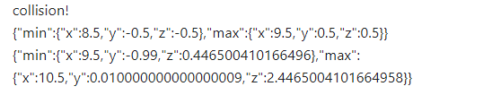

# Lesson 3 - Vehicles & Collisions

In this lesson we add vehicles to the roads, and put some collision detection in place.

See this [demo](https://diarmidmackenzie.github.io/aframe-game-tutorial/lessons/lesson3/step9.html) for a preview of what we're going to get to by the end of this lesson.

Click the Mouse, or press Space Bar to advance your cute little cube safely across the roads, taking care to avoid the vehicles...


### This Lesson's New Tool - GitHub Desktop

I'm going to introduce version control using Git and GitHub Desktop.

-- Still to complete this part of the tutorial -- 


### On with the coding...

We'll start by adding some vehicles onto our roads.

Create a new module in the `src` folder, called `vehicles.js` with the following code:

```
AFRAME.registerComponent('road', {

  schema: {
    numVehicles: { type : 'number', default: 10},
    speed: {type: 'number', default: 3},
  },

  init() {
    this.vehicles = []

    for (var ii = 0; ii < this.data.numVehicles; ii++) {
      const vehicle = this.createVehicle(ii)
      this.vehicles.push(vehicle)
    }
  },

  createVehicle(index) {
    const roadLength = this.roadLength()
    zPosition = (Math.random() * roadLength) - (roadLength / 2)

    const vehicle = document.createElement('a-box')
    vehicle.setAttribute("depth", 2)
    vehicle.setAttribute("id", `${this.el.id}-vehicle-${index}`)
    vehicle.setAttribute("color", "blue")
    vehicle.object3D.position.set(0, 0.5, zPosition)
    this.el.appendChild(vehicle)

    return vehicle
  },

  roadLength() {
    return this.el.getAttribute("depth")
  }
})
```

Now, in `index.html`, add the following line to the `head`:

```
    <script src="./src/vehicles.js"></script>
```

And modify the HTML for our roads to the following (adding a `road` component to each of our roads)

```
        <a-box color="black" position="10 -0.99 0" width="1" depth="500" road="numVehicles: 10; speed: -10">
        </a-box>
        <a-box color="black" position="20 -0.99 0" width="1" depth="500" road="numVehicles: 10; speed: -12">
        </a-box>
        <a-box color="black" position="30 -0.99 0" width="1" depth="500" road="numVehicles: 10; speed: 14">
        </a-box>
```

[Code](https://github.com/diarmidmackenzie/aframe-game-tutorial/blob/main/lessons/lesson3/step1.html) [Demo](https://diarmidmackenzie.github.io/aframe-game-tutorial/lessons/lesson3/step1.html)

With these changes, we should see some vehicles (for now, they are just blue rectangles) distributed on our roads:


> Explanation of code to follow


### Making the vehicles move

We've configured a speed for the vehicles on each road, but they aren't actually moving yet.

To make them move, we make some more changes to  `vehicles.js`

At the end of the module, we define a new component, `z-movement`

```
AFRAME.registerComponent('z-movement', {

  schema: {
    speed: {type: 'number', default: 3},
  },

  tick(time, timeDelta) {

    const delta = this.data.speed * timeDelta / 1000
    this.el.object3D.position.z += delta
  }
})
```


And when we create the vehicles, we set `z-movement` to the appropriate value:

```
vehicle.setAttribute("z-movement", {speed: this.data.speed})
```

[Code](https://github.com/diarmidmackenzie/aframe-game-tutorial/blob/main/lessons/lesson3/step2.html) [Demo](https://diarmidmackenzie.github.io/aframe-game-tutorial/lessons/lesson3/step2.html)

>  Explanation of code to follow

### Looping the vehicles

The vehicles now move, but they just continue in one direction forever, so after a time, our play area becomes empty again.

Let's fix this so that when they reach the edge of the play area, the vehicles loop round to the start again.

Add two additional values to the `z-movement` schema:

```
    loopLower: {type: 'number', default: -100},
    loopUpper: {type: 'number', default: 100},
```


Extend the `tick` processing in `z-movement` to include the following:


```
    const loopLength = this.data.loopUpper - this.data.loopLower

    if (this.el.object3D.position.z > this.data.loopUpper) {
      this.el.object3D.position.z -= loopLength
    }

    if (this.el.object3D.position.z < this.data.loopLower) {
      this.el.object3D.position.z += loopLength
    }
```

And finally, include values for the two new schema properties where we set `z-movement`:

```
    vehicle.setAttribute("z-movement", {speed: this.data.speed,
                                        loopLower: -roadLength/2,
                                        loopUpper: roadLength/2})
```

[Code](https://github.com/diarmidmackenzie/aframe-game-tutorial/blob/main/lessons/lesson3/step3.html) [Demo](https://diarmidmackenzie.github.io/aframe-game-tutorial/lessons/lesson3/step3.html)

>  Explanation of code to follow


### Detecting collisions

In `vehicles.js`, add another new component:

```
AFRAME.registerComponent('collision-check', {

  schema: {
    target: {type: 'selector', default: '#player'}
  },

  init() {

    this.targetBox = new THREE.Box3()
    this.thisBox = new THREE.Box3()
  },

  tick() {

    this.targetBox.setFromObject(this.data.target.object3D)
    this.thisBox.setFromObject(this.el.object3D)

    if (this.thisBox.intersectsBox(this.targetBox)) {
      alert("collision!")
    }
  }
})
```


And set this component on each vehicle by adding this line immediately after setting `z-movement` on the new vehicle:

```
    vehicle.setAttribute("collision-check", "target: #player")
```

[Code](https://github.com/diarmidmackenzie/aframe-game-tutorial/blob/main/lessons/lesson3/step4.html) [Demo](https://diarmidmackenzie.github.io/aframe-game-tutorial/lessons/lesson3/step4.html)

>  Explanation of code to follow

### Debugging collisions

We now have some basic collision detection, which will pop up an alert when we collide with a vehicle.

However, if we test this, we'll find that the collision detection is not very accurate - it triggers whenever our cube is *near* to a vehicle, rather than when we actually collide with one.

To troubleshoot this, let's add some additional diagnostics when we collide:

Update the `alert` in the `collision-check` component to the following.

```
      alert(`collision!\n${JSON.stringify(this.targetBox)}\n${JSON.stringify(this.thisBox)}`)
```

[Code](https://github.com/diarmidmackenzie/aframe-game-tutorial/blob/main/lessons/lesson3/step5.html) [Demo](https://diarmidmackenzie.github.io/aframe-game-tutorial/lessons/lesson3/step5.html)

This will output the two bounding boxes that are being checked for collisions.


> Explanation of code to follow

If we look at the "min" and "max" values for x, we can see that the box being checked is actually a lot more than 1 unit wide (6.18... - 4.81 = 1.37...)

The reason for this is that the bounding boxes are aligned to the x, y & z axes of "world space".  If you recall in Lesson 1, we rotated our `gameArea` entity by 60 degrees.

This means that a box drawn around our rotated cube ends up much bigger than the cube, and we end up with inaccurate collision detection.


There's various ways we could fix this.

The simplest is to re-orient our `gameArea` so that it's aligned with world space.

To keep our view the same, we'll need to make a compensating change to the camera rotation.  Recall in our last lesson I explained that it was better not to combine two different camera rotations as it could get confusing?  Well we can keep them separated by adjusting our HTML as follows:

Replace these lines:

```
      <a-entity id ="game-camera" position="0 50 80" camera="active:false; fov:30" rotation = "-25 -10 0"></a-entity>
      <a-entity id="gameArea" rotation="0 60 0" visible="false">
```

With these:

```
      <a-entity id="camera-rig" rotation="0 -60 0">
          <a-entity id ="game-camera" position="0 50 80" camera="active:false; fov:30" rotation = "-25 -10 0"></a-entity>
      </a-entity>

      <!-- gameArea must be in world space for accurate collision detection-->
      <a-entity id="gameArea" visible="false">
```

By wrapping the camera with an additional `camera-rig` entity, with the reverse rotation that we had applied to the `gameArea`, we keep the same camera view, while aligning the `gameArea` with world space, making our collisions much more accurate.

[Code](https://github.com/diarmidmackenzie/aframe-game-tutorial/blob/main/lessons/lesson3/step6.html) [Demo](https://diarmidmackenzie.github.io/aframe-game-tutorial/lessons/lesson3/step6.html)


>  Explanation of code to follow


### Fixing collisions (part 2)

If we test, there is one further issue with collisions to fix.

When our cube is one step before or after a road, we want them to be safe, not hit by traffic.

If we test this, we'll get an alert like this:




Sine making the last fix, our boxes are exactly 1 unit wide, as expected (8.5 to 9.5 for the cube, and 9.5 to 10.5 for the vehicle).

The problem is that the `intersectsBox()` function compares the two boxes, *inclusive* of their edges, so a box from 8.5 to 9.5 will be considered to intersect a box from 9.5 to 10.5.

There's no option to change this behaviour, but what we can do is to scale one of the boxes down ever so slightly, so that a collision won't be detected in this case.

We can do this by adding one line to the `collision-check` component, before making the  `intersectsBox` check.

```
this.thisBox.expandByScalar(-0.001)
```

[Code](https://github.com/diarmidmackenzie/aframe-game-tutorial/blob/main/lessons/lesson3/step7.html) [Demo](https://diarmidmackenzie.github.io/aframe-game-tutorial/lessons/lesson3/step7.html)


>  Explanation of code to follow

### Game Over!

Our collision detection is now accurate - time to connect this into the gameplay, rather than just triggering an alert.

Currently, when the game ends, we switch immediately back to the title screen.  Let's change it so that we display a "game over" screen first, and then go back to the title screen.

In `index.html` add another 2D button.  We'll display this at game over.

```
    <button id="game-over"
            style="position: absolute;
                top: 50%;
                left: 40%;
                width: 20%;
                height: 15%;
                font-size: 150%;
                background: #bbbbff;
                display: none"
            onClick="reset()">
      <p>GAME OVER</p>
      <p>Click to continue</p>
  </button>
```

In `title.js`, modify the `gameOver()`function to the following:

```
function gameOver() {

  const gameOverButton = document.getElementById("game-over")
  gameOverButton.style.display = "block"

  removeEventListener("game-over", gameOver)
}
```

And add a `reset()` function that does some of the work that used to be done by the `gameOver()` function:

```
function reset() {
  const startButton = document.getElementById("start")
  startButton.style.display = "block"

  const gameTitle = document.getElementById("gameTitle")
  gameTitle.setAttribute("visible", true)

  const gameArea = document.getElementById("gameArea")
  gameArea.setAttribute("visible", false)

  const gameOverButton = document.getElementById("game-over")
  gameOverButton.style.display = "none"

  setActiveCamera("title-camera")
}
```

Finally, in `vehciles.js` remove the `alert` and replace it with this:

```
      this.el.emit("game-over")
```

[Code](https://github.com/diarmidmackenzie/aframe-game-tutorial/blob/main/lessons/lesson3/step8.html) [Demo](https://diarmidmackenzie.github.io/aframe-game-tutorial/lessons/lesson3/step8.html)


>  Explanation of code to follow

### Freeze!

One final change is to freeze the game when the "game over" button pops up (and then ensure it starts again when the players restarts the game)

In `title.js`, at the start of the `gameOver` function, add these lines:

```
  const gameArea = document.getElementById("gameArea")
  gameArea.pause()
```

... and in the `start` function, when we make `gameArea` visible, add this line:

```
  gameArea.play()
```

[Code](https://github.com/diarmidmackenzie/aframe-game-tutorial/blob/main/lessons/lesson3/step9.html) [Demo](https://diarmidmackenzie.github.io/aframe-game-tutorial/lessons/lesson3/step9.html)

>  Explanation of code to follow


### Recap

We've now got a very simple (and rather easy) game, where the user can succeed or fail.

In getting to this stage, we've used various new concepts.

- schemas for A-Frame Components
- `for` loops
- Arrays
- creating new HTML entities from JavaScript
- Using `tick` to move entities
- `Box3` and collision detection, including finding and fixing various problems that can arise.
- `pause` and `play` on parts of an A-Frame `scene`

We've also learned how to use version control (using Git and GitHub Desktop) to keep track of our source code as it evolves.


