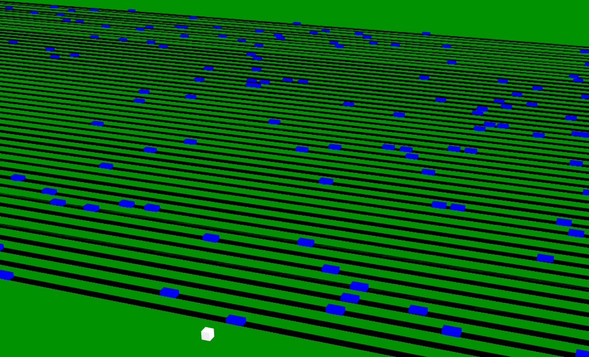

# Lesson 4 - Scrolling the Camera View

In this lesson we extend the game to have a lot more roads to cross, and we start to scroll the camera view.

See this [demo](https://diarmidmackenzie.github.io/aframe-game-tutorial/lessons/lesson4/step19/index.html) for a preview of what we're going to get to by the end of this lesson.

This is the first time you may have trouble completing the demo game.  The traffic gets pretty fast towards the end, but it is possible to cross safely.

> This lesson isn't fully complete yet - detailed explanations of the code fragments are still to be completed.

### Adding some more roads

Let's increase the number of roads in our game.

In our `index.html` file, our roads look like this:

```
        <a-box color="black" position="10 -0.99 0" width="1" depth="500" road="numVehicles: 10; speed: -10">
        </a-box>
        <a-box color="black" position="20 -0.99 0" width="1" depth="500" road="numVehicles: 10; speed: -12">
        </a-box>
        <a-box color="black" position="30 -0.99 0" width="1" depth="500" road="numVehicles: 10; speed: 14">
        </a-box>
```

We could just copy & paste a lot more roads like that into our HTML file.  But if we want *a lot* of roads - and especially if we want to eventually have an *endless* set of roads, we want to move to creating these roads from within a Javascript component.

Let's create a new A-Frame component called `landscape` that creates a whole sequence of roads:

```
AFRAME.registerComponent('landscape', {

  schema: {
    numRoads: { type : 'number', default: 50},
    initialSpace: { type : 'number', default: 5},
    interval: { type : 'number', default: 3},
  },

  init() {
    this.roads = []

    for (var ii = 0; ii < this.data.numRoads; ii++) {
      const road = this.createRoad(ii)
      this.roads.push(road)
    }
  },

  createRoad(index) {
    const speed = this.getRoadSpeed(index)
    const xPosition = this.getRoadPosition(index)

    const road = document.createElement('a-box')
    road.setAttribute("id", `road-${index}`)
    road.setAttribute("color", "black")
    road.setAttribute("depth", 500)
    road.setAttribute("width", 1)
    road.setAttribute("road", {numVehicles: 10,
                               speed: speed})
    road.object3D.position.set(xPosition, -0.99, 0)

    this.el.appendChild(road)

    return road
  },

  getRoadSpeed(index) {
    const speed = 10
    return speed
  },

  getRoadPosition(index) {
    const position = this.data.initialSpace + 
                     (index * this.data.interval)
    return position
  }
})
```


We can include this component inside `vehicles.js`, alongside our existing components.

Now, in `index.html`, remove the three roads that we had before, and replace them with a single entity as follows:

```
        <a-entity landscape>
        </a-entity>
```

[Code](https://github.com/diarmidmackenzie/aframe-game-tutorial/blob/main/lessons/lesson4/step1) [Demo](https://diarmidmackenzie.github.io/aframe-game-tutorial/lessons/lesson4/step1/index.html)

Having made these changes, we now have a lot of roads to cross...!




### Creating some variety

Lots of roads, but they are spaced in a completely uniform pattern, and the traffic is all rather spookily moving in the same direction, at the exact same speed.

We can add some variety by updating the `getRoadSpeed()` and `getRoadPosition()` functions like this:

```
  getRoadSpeed(index) {
    const speed = Math.sign(Math.random() - 0.5) * (10 + index + Math.random(10))
    return speed
  },

  getRoadPosition(index) {
    const position = this.data.initialSpace + 
                     (index * this.data.interval) + 
                     Math.floor(Math.random() * this.data.interval)
    return position
  }
```

[Code](https://github.com/diarmidmackenzie/aframe-game-tutorial/blob/main/lessons/lesson4/step2) [Demo](https://diarmidmackenzie.github.io/aframe-game-tutorial/lessons/lesson4/step2/index.html)


### Removing the limits

If you play the game, you'll still hit the "game over" screen when you get 30 steps forwards.  We could increase the limit, but given that we're (eventually) going to be making this an endless game, better to just remove the limit altogether.

In the `game-controls` component, just remove these lines

```
    if (this.el.object3D.position.x > 30) {
      this.el.emit("game-over")
    }
```

[Code](https://github.com/diarmidmackenzie/aframe-game-tutorial/blob/main/lessons/lesson4/step3) [Demo](https://diarmidmackenzie.github.io/aframe-game-tutorial/lessons/lesson4/step3/index.html)


### Making the Camera Pan

Now the player can move a lot further, we need the camera to pan, so that they stay on-screen.

A simple implementation is to add a component to the camera that tracks the player's movement.


In `game-control.js` we add the following new component...

```
AFRAME.registerComponent('follow-entity', {
  schema: {
    type: 'selector'
  },

  init() {
    this.offsetVector = new THREE.Vector3()
    this.offsetVector.copy(this.el.object3D.position)
    this.offsetVector.sub(this.data.object3D.position)
  },

  tick() {    
    this.el.object3D.position.copy(this.data.object3D.position)
    this.el.object3D.position.add(this.offsetVector)
  }
})
```

...and in `index.html`, we attach it to the camera like this:

```
      <a-entity id="camera-rig" rotation="0 -60 0" follow-entity="#player">
```

If you try tis out, you'll see the camera does move, but there's a couple of problems:

- Because the camera follows the player *exactly* you don't get any sense of the player moving - it seems more like the landscape is moving under the player
- As we move forwards, we see some nasty visual effects, with the roads sometimes disappearing, either partially or completely.

[Code](https://github.com/diarmidmackenzie/aframe-game-tutorial/blob/main/lessons/lesson4/step4) [Demo](https://diarmidmackenzie.github.io/aframe-game-tutorial/lessons/lesson4/step4/index.html)

### Fixing the Road Surfaces

The problems with the road surfaces are pretty ugly, so let's fix them first...

The issue we have here is known as "z-fighting".  The 3D renderer tries to render the polygons that make up objects from the furthest to the closest to the camera.  If two polygons have very similar depths, there is a risk they get rendered in the wrong order.

Back in lesson 2, we set the roads at a height of -0.99, whereas the green surface has a height of -1.  The intention of this was to avoid z-fighting, so why are we seeing it?

The issue here is that we aren't getting enough precision in our  "depth buffer".  We can fix it by setting this configuration on the camera

```
near: 20	
```

so overall our camera config should look like this:

```
camera="active:false; fov:30; near: 20"
```

Here's a technical explanation of the issue, and how that helps...

> The "depth buffer" is used when rendering shapes to determine what should be in front, and what should be behind.
>
> Our camera is configured with a "near plane" and a "far plane".  The camera does not render anything closer to the camera than the "near plane", or further from the camera than the "far plane".
>
> The [default values](https://aframe.io/docs/1.3.0/components/camera.html#properties) for these are 0.005 (5mm) for the near plane, and 10,000 (10km for the far plane)
>
> When working with the depth buffer, the renderer represents every possible value between the near plane & the far plane in a range from 0 to 1.
>
> For things up close, we need lots of precision, and for things far away, we can get away with less precision, so the mapping is set up so that a lot of that 0 to 1 range corresponds to values close to the camera.
>
> However, we have set up our camera with a "zoom" effect, about 50m above our play area.  That means that we're only using a small fraction of that 0 to 1 range for the depths of the objects we are actually rendering, to the point where we don't have enough precision to discriminate the 0.01m difference between the road surface and the play area.
>
> By moving our "near plane" out from 0.005 to 20, we get a lot more precision in our depth buffer in the area that we want to render.

[Code](https://github.com/diarmidmackenzie/aframe-game-tutorial/blob/main/lessons/lesson4/step5) [Demo](https://diarmidmackenzie.github.io/aframe-game-tutorial/lessons/lesson4/step5/index.html)


### Improving the Camera Panning

As we've seen, following the player directly doesn't really give us the visual experience we want.

The camera following mechanism is a good start, but we really want to follow something other than the player.

Our solution is to introduce a new (invisible) entity into the scene, have the camera follow that entity, and then control the movements of that entity based on what the player does.  By adjusting the movement of this entity, we can control the detailed behaviour of the camera panning.

So let's add a new entity to the scene, called `camera-focus`.  I've made this another child of `gameArea` entity, just next to the `player` entity.

        <a-entity id="camera-focus" position="0 0 0">
        </a-entity>

And we instruct the camera to follow this entity:

```
<a-entity id="camera-rig" rotation="0 -60 0" follow-entity="#camera-focus">
```

Now we just have to define how we want this camera focus to move.

To start with, we'll define this component in `game-controls.js`

```
AFRAME.registerComponent('pacer-movement', {
  schema: {
    speed: { type: 'number', default: 1 }
  },

  tick(t, dt) {    
    const increment = dt / 1000 * this.data.speed
    this.el.object3D.position.x += increment
  }
})
```

And configure this onto the `camera-focus` entity like this:

```
    <a-entity id="camera-focus" position="0 0 0" pacer-movement>
```

This gives us a basic behaviour where the camera scrolls smoothly forwards, instead of following the player.

[Code](https://github.com/diarmidmackenzie/aframe-game-tutorial/blob/main/lessons/lesson4/step6) [Demo](https://diarmidmackenzie.github.io/aframe-game-tutorial/lessons/lesson4/step6/index.html)

### Policing Camera Limits

What happens if the camera scrolls ahead and the player doesn't move?

The player just gets stranded off-screen, for ever...

Let's update things so that this leads to "game over".  This means that the camera movement puts pressure on the player to keep moving forwards.

We can do this with another simple component:

```
AFRAME.registerComponent('pacer-limits', {
  schema: {
    player: { type: 'selector', default: "#player" }
  },

  tick() {    
    if (this.el.object3D.position.x - this.data.player.object3D.position.x > 20) {
      this.el.emit("game-over")
    }
  }
})
```

... which we configure on the `camera-focus` entity.

```
        <a-entity id="camera-focus" position="0 0 0" pacer-movement pacer-limits>
```


We also need to reset the `pacer` entity's position at the start of each game, so that the camera always starts pointing at the player.

We can do that by adding these two lines to `initializeGameState()` in the `title.js` module.

```
  const cameraFocus = document.getElementById("camera-focus")
  cameraFocus.object3D.position.set(0, 0, 0)
```

[Code](https://github.com/diarmidmackenzie/aframe-game-tutorial/blob/main/lessons/lesson4/step7) [Demo](https://diarmidmackenzie.github.io/aframe-game-tutorial/lessons/lesson4/step7/index.html)


### Keeping up with the Player

Our camera movement is better, but we still have a problem when the player moves quickly - they can end up in the far distance, with a poor view of the roads, and have to wait a long time for the camera to catch up.

We can enhance our `pacer-movement` controls to speed up when the player moves ahead of it, so that it catches up.  We can make it catch up faster, the further it gets behind.  Let's adjust the code as follows:

```
AFRAME.registerComponent('pacer-movement', {
  schema: {
    speed: { type: 'number', default: 1 },
    player: { type: 'selector', default: "#player" }
  },

  tick(t, dt) {

    let speed = this.data.speed
    const amountBehind = this.data.player.object3D.position.x - this.el.object3D.position.x
    if (amountBehind > 5) {
      speed += (amountBehind - 5) / 3
    }

    const increment = dt / 1000 * speed
    this.el.object3D.position.x += increment
  }
})
```


Given that the `pacer-movement` component is not calculating the distance between the pacer & the player every frame, it's easy for it to also take on the work of the `pacer-limits` component.

Just add these two lines to `pacer-movement`...

```
    if (amountBehind < -20) {
      this.el.emit("game-over")
    }
```

.. and remove the `pacer-limits` component altogether from `index.html` and `game-controls.js`.

[Code](https://github.com/diarmidmackenzie/aframe-game-tutorial/blob/main/lessons/lesson4/step8) [Demo](https://diarmidmackenzie.github.io/aframe-game-tutorial/lessons/lesson4/step8/index.html)


### Keeping Score

We're close to having a fun, playable game here.  But it would be great to keep track of our scores, so that we can compare how we do from one run to the next.

We can do this with the following code:

In `index.html`, at the end of the `body`, we add the following 2D element, to show our score in the upper right corner.

    <div id="score"
         style="position: absolute;
                top: 5%;
                right: 5%;
                width: 10%;
                height: 10%;
                font-size: 300%;
                font-family:Arial;
                user-select: none;
                color: white">
    </div>


In `game-controls.js`, we create a new component, `track-score`, like this:

```
AFRAME.registerComponent('track-score', {
  schema: {
    player: { type: 'selector', default: "#player" },
    display: { type: 'selector', default: "#score" }
  },

  init() {
    this.score = 0
    this.data.display.innerHTML = this.score

    this.playerMoved = this.playerMoved.bind(this)
    this.data.player.addEventListener("player-moved", this.playerMoved)
  },

  playerMoved() {
    this.score = Math.max(this.data.player.object3D.position.x, this.score)
    this.data.display.innerHTML = this.score
  }
})
```

This listens for a `player-moved` event, and when it receives it, it checks the player's position to see whether or not to increase the score.

We could have implemented this using a `tick` rather than an event, but it's inefficient and unnecessary to check for score updates every frame - it's more efficient to just check when the player moves.

In order to trigger this function each time the player moves, we just need to add this line to the `stepForwards()`function in the `game-controls` component:

```
    this.el.emit("player-moved")
```


Two more things to do to get our scoreboard working:

First, we need to include the `track-score` component on an entity in our scene.

We could add it to an existing entity, e.g. `scene`, `gameArea`or `player`, but in the interests of keeping things clearly organized, and  as simple as possible, we'll add a new entity like this:

```
      <a-entity id="scoreboard-controls" track-score="player:#player;display:#score">
      </a-entity>
```


Secondly, we need to make sure we reset the score at the start of each new game.  A simple way to do that is to remove & re-add the `track-score` component, which will result in it being re-initialized.  We can do this inside the `initializeGameState()` function in `title.js`

```
  const scoreBoardControls = document.getElementById("scoreboard-controls")
  scoreBoardControls.removeAttribute("track-score")
  scoreBoardControls.setAttribute("track-score", 
                                  "player:#player;display:#score")
```

[Code](https://github.com/diarmidmackenzie/aframe-game-tutorial/blob/main/lessons/lesson4/step9) [Demo](https://diarmidmackenzie.github.io/aframe-game-tutorial/lessons/lesson4/step9/index.html)

### Final Bug Fixes

We now have a genuinely challenging game to play - can you get beyond the last road?

Before we close this lesson, there's just one small bug to fix....

After a collision that leads to "game over", the player can still move, and can still increase their score!

When we handle the `game-over` event in our `gameOver()` function, we pause the game area like this:

```
gameArea.pause()
```

So why can the player still move forwards?

The reason is that pausing an A-Frame entity doesn't automatically turn off event listeners.  So the "click" and "keydown" events can still be detected and handled.

We can fix this by adding the following to the  `game-controls` component.

```

  play() {
    window.addEventListener("click", this.stepForwards)
    window.addEventListener("keydown", this.keyDown)
  },

  pause() {
    window.removeEventListener("click", this.stepForwards)
    window.removeEventListener("keydown", this.keyDown)
  },

  remove() {
    window.removeEventListener("click", this.stepForwards)
    window.removeEventListener("keydown", this.keyDown)
  },
```

The `play`, `pause` and `remove` are automatically called (if they exist), whenever a A-Frame entity is paused, restarted or deleted.  By removing & re-adding the event listeners, we can ensure that the `game-controls` component fully pauses when the game area is paused.

[Code](https://github.com/diarmidmackenzie/aframe-game-tutorial/blob/main/lessons/lesson4/step10) [Demo](https://diarmidmackenzie.github.io/aframe-game-tutorial/lessons/lesson4/step10/index.html)


### Recap

We've now got a genuinely challenging, playable game.

In getting to this stage, we've used various new concepts.

- creating HTML entities using JavaScript
- using `Math.random` to add variety into our game
- vector arithmetic (adding and subtracting) using `THREE.Vector3`
- the `a-plane` entity, and rotations
- breaking down sophisticated camera panning behaviour into simple, composable elements
- implementing smooth movement by paying attention to the `dt` or `deltaTime` parameter on a `tick()` call
- triggering behaviour on events, rather than ticks, for efficiency reasons
- updating 2D HTML elements using the `innerHTML` property
- the `user-select` style property to make text non-highlightable
- `pause`, `play` and `remove` functions in A-Frame components

We've also learned how to use version control (using Git and GitHub Desktop) to keep track of our source code as it evolves, including checking in changes, branching and merging.
