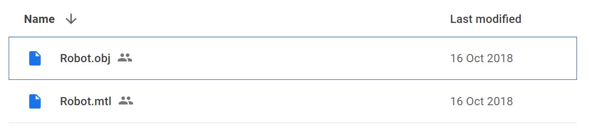
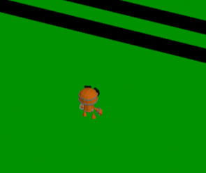
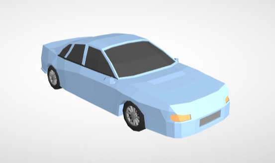
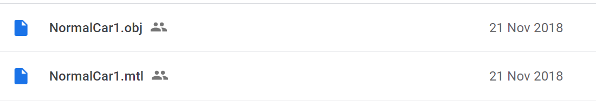
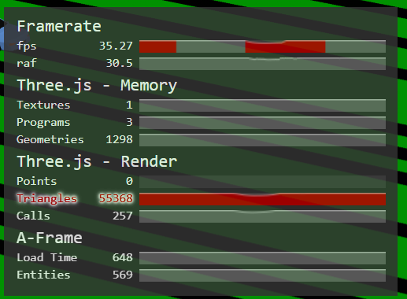
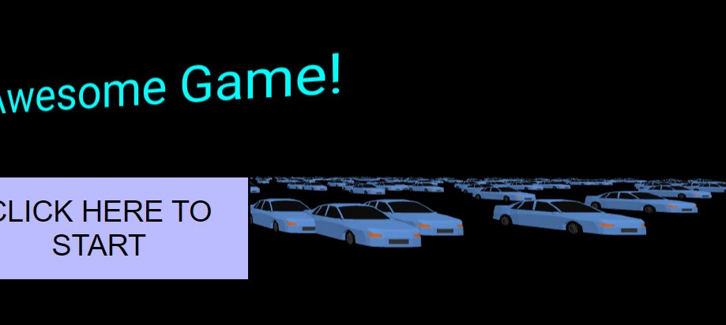
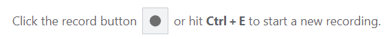
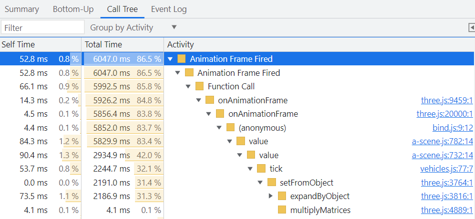
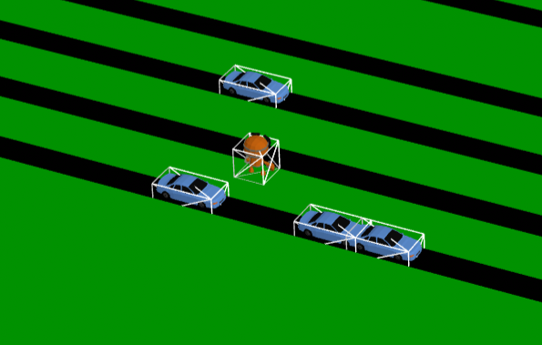
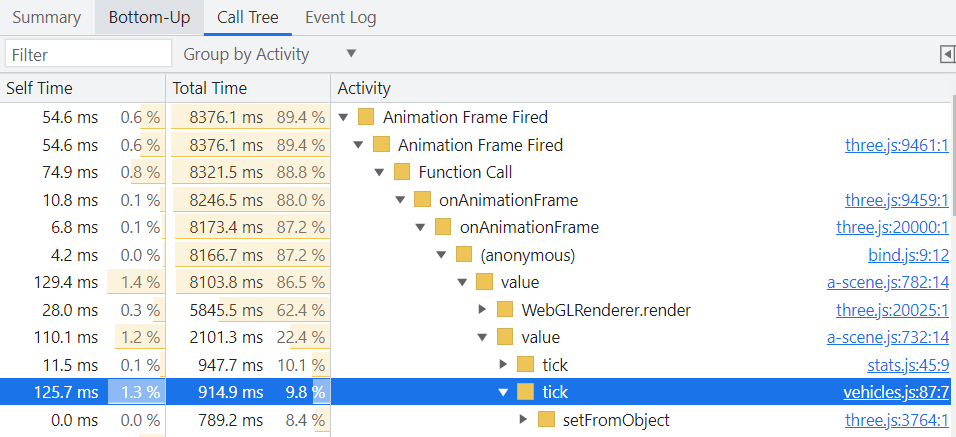

# Lesson 5 - Improving the Graphics

In this lesson we replace our blocky graphics with some better looking 3D models.  We also make some performance improvements, and make the game truly endless.

See this [demo](https://diarmidmackenzie.github.io/aframe-game-tutorial/lessons/lesson5/step9/index.html) for a preview of what we're going to get to by the end of this lesson.

> This lesson isn't fully complete yet - detailed explanations of the code fragments are still to be completed.


### This Lesson's New Tool - Node.js & NPM

This lesson, we'll introduce and make use of Node.js & NPM

[Node.js](https://nodejs.org/en/) is an environment that allows JavaScript code to be run directly on your computer, rather than being run in the browser.  This can be useful in various ways, but for us the key value is being able to run some helpful JavaScript utilities while developing our game.  The final game itself will run inside the browser.

[NPM](https://www.npmjs.com/) is the Node Package Manager, a repository of JavaScript packages that can be installed and run inside Node.js.

So we'll find some useful tools, in NPM, and we'll run them inside Node.js.

Let's get started...

We can install Node.js from this link.

https://nodejs.org/en/

You should install the LTS version (labelled as "Recommended for Most Users").  When installed, Node.js automatically installs NPM alongside it.

Now if you open a Command Prompt and run `npm` you should see something like this:

```
npm <command>

Usage:

npm install        install all the dependencies in your project
npm install <foo>  add the <foo> dependency to your project
npm test           run this project's tests
...
```

Node.js is pretty complicated, so for now we're just going to introduce some specific things that we need.

We're going to use NPM to install two packages that we need for this lesson.

First, run:

```
npm install -g http-server
```

This will install the [http-server](https://www.npmjs.com/package/http-server) npm package globally (i.e. it will be available for use in all our projects on this computer)

Up until now we've been testing out our web pages by opening files from our file system directly in the browser.  That's worked fine up until now, but when we add 3D models into our game, it won't work any more, because browsers have restrictions on reading certain types of file, including 3D models, directly from the file system.

Instead we need to run our own HTTP server.  This is a small piece of software that listens for requests over the network, and responds to them with data such as files & web pages.

To do this, navigate in your command prompt to the folder containing your code., and run:

```
http-server
```

You should see something like this:

```
Starting up http-server, serving ./
Available on:
  http://169.254.150.186:8080
  http://192.168.1.169:8080
  http://127.0.0.1:8080
Hit CTRL-C to stop the server
```

Now open this URL in your browser...

http://127.0.0.1:8080

... and you should see your game.  `127.0.0.1` is an IP address.  IP addresses are usually used for computers to talk to each other, but `127.0.0.1` is a special IP address that basically means "myself" on every computer.

By running an HTTP server on `127.0.0.1`, the browser sees itself as retrieving data from the network, rather than the local file-system, and the restrictions that exist in terms of reading particular types of tile from the file system don't apply.

Going forwards, we'll view the game in this way, rather than via the file system - that way files like 3D models won't be blocked.


There's one more package that we want to install for use shortly...

[obj2gltf](https://www.npmjs.com/package/obj2gltf) is a tool which converts files from the one 3D model format (OBJ) to another format (GLTF).  You can install it like this:

```
npm install -g obj2gltf
```

We'll come back to this in a few minutes...


### Introducing our Avatar

First thing to work on graphics-wise is our avatar.  To turn him into something more characterful than a small white cube, we'll need a 3D model.

I've picked out [this model](https://threejs.org/examples/#webgl_animation_skinning_morph), for which the original source is [here](https://quaternius.com/packs/animatedrobot.html).


The robot comes with a range of built-in animations.  We're not going to use those this lesson, but will do so in a future lesson.

When using assets created by others, we need to be conscious and respectful of the license under which we are using the model.  This particular asset is released under a [CC0 license](https://creativecommons.org/publicdomain/zero/1.0/), which is a permissive license that puts few restrictions on what we can do with the model.

Some other models may be released under more restrictive licenses that prevent you from modifying the model, using ithem in commercial products, or even using them at all!

For use in A-Frame, we want the model in either GLTF or GLB format (GLB is just a binary version of GLTF, which is a readable text format).

The model's not directly available in that format, but we can get it in FBX, OBJ or Blend formats.

We're going to use a node.js tool called [obj2gltf](https://www.npmjs.com/package/obj2gltf) which converts OBJ files to GLTFs (and which you should have installed earlier - if you skipped over that, please go back and install Node.js, and the `obj2gltf` and `http-server` NPM packages, as we'll need them both)

From this URL, click the "Download" button, and choose the "OBJ" folder.  Download the two files Robot.obj and Robot.mtl, and store them in a new folder in your project called `assets`




Now, from a command prompt, change directory so that you are in the assets folder

In the assets folder, run this command to convert the OBJ file into a GLTF.

```
obj2gltf -i Robot.obj -o Robot.gltf
```

You might be wondering about the `.mtl` file that you also downloaded.  That defines the materials used in the 3D model.  It is referenced by the `.obj` file that you downloaded, and its content is incorporated into the `.gltf` file.

Now that we have a GLTF file, we can use it in our scene.

At the beginning of your `<a-scene>`, declare the asset like this.

      <a-assets>
        <a-asset-item id="robot-model" src="./assets/Robot.gltf"></a-asset-item>
      </a-assets>

The path in the `src` should provide a path to the `assets` folder from wherever your `index.html` file is.   The above code will be correct if your assets folder is in the same folder as your `index.html` file.

The above code makes the GLTF model *available* for use in our scene.  We then actually place the model in our scene by replacing these lines:

        <a-box id="player" color="white" game-controls position="0 0 0">
        </a-box>

with these:

        <a-entity id="player" game-controls position="0 0 0">
          <a-entity gltf-model="#robot-model" scale="0.3 0.3 0.3" rotation="0 90 0" position="0 -0.6 0">
          </a-entity>
        </a-entity>


Finally, having replaced the cube with the model, I thought it would look better with the camera zoomed in a little more, so I updated the `camera` component on the `game-camera` entity to these values

```
camera="active:false; fov:15; near: 20" rotation = "-30 -5 0"
```

With these changes, you should see that our plucky little cube has been replaced by a valiant robot.

Remember that you need to view the page via a web server at http://127.0.0.1:8080, rather than viewing the file directly.  If you missed this point earlier, go back and review the section on `http-server` in the section where we introduced Node.js and NPM.



[Code](https://github.com/diarmidmackenzie/aframe-game-tutorial/blob/main/lessons/lesson5/step1) [Demo](https://diarmidmackenzie.github.io/aframe-game-tutorial/lessons/lesson5/step1/index.html)

(note that because of the way my sample code is structured, the path to the assets folder is a little different from the code above)


### Adding some real cars

Now, let's turn our attention to the cars.

For these I chose a model from the same author, again with a CC0 license.

https://quaternius.com/packs/cars.html

It's going to look like this...




From the Download link, I downloaded these two files.



As before, we need to convert these files to GLTF format, like this:

```
obj2gltf -i NormalCar1.obj -o NormalCar1.gltf
```

And include these as assets in our scene by adding this line inside our `<a-assets>`  entity

```
<a-asset-item id="car-model" src="../../../assets/NormalCar1.gltf"></a-asset-item>
```

To replace our blocks with cars, we then modify the `createVehicle()` function in the `road` component in `vehicles.js`.

We replace these three lines:

```
    const vehicle = document.createElement('a-box')
    vehicle.setAttribute("depth", 2)
    vehicle.setAttribute("color", "blue")
```

With these:

```
    const vehicle = document.createElement('a-entity')
    vehicle.setAttribute("gltf-model", "#car-model")
    vehicle.object3D.scale.set(0.5, 0.5, 0.5)
```

If you run this code, you should see the blue blocks in the scene replaced by cars.

You'll also see a few problems:

- Half the cars are driving backwards
- Depending on your computer, you may see a much lower frame rate than before.

We'll tackle those backwards drivers in due course.

First let's look at the performance issues...

In `index.html`, add the `stats` component to the the `<a-scene>` entity, like this:

```
<a-scene vr-mode-ui="enabled: false" stats>
```


When you run the game again, you should now see a stats panel in the top-left corner, showing you the frame rate, and various other statistics.



[Code](https://github.com/diarmidmackenzie/aframe-game-tutorial/blob/main/lessons/lesson5/step2) [Demo](https://diarmidmackenzie.github.io/aframe-game-tutorial/lessons/lesson5/step2/index.html)

The main issue here is not actually the Triangle count, but the "Calls".  A "Call" (or "draw call") is an instruction from the CPU to the GPU to render a particular 3D model.  As a guideline, you want to keep this number below 200, and ideally below 100, for good performance.

The car model that we used actually consists of 12 different sub-objects (chassis, windows, wheels etc.), each of which requires a separate draw call every frame.  And that happens for every car visible on screen...

Fortunately, if you are drawing the same model more than once, there's a special technique called "instancing" that can be used to draw all the instances of the model with a single draw call (in this case, with a 12-part model, we'll need 12 draw calls in total, but that's a lot better than 250+)

### Using Instancing

A-Frame doesn't support instancing natively, but there's a component we can use to add instancing capabilities to our scene.

In the `head` of `index.html` add the following line:

```
    <script src="https://cdn.jsdelivr.net/gh/diarmidmackenzie/instanced-mesh@v0.7.0/src/instanced-mesh.js"></script>
```


Then inside the scene, add the following entity:

```
      <a-entity id="car-instanced-mesh"
                gltf-model="#car-model"
                instanced-mesh="capacity:1000;
                                positioning: world;
                                updateMode: auto">
      </a-entity>
```


And in the `createVehicle()` function in the `road` component in `vehicles.js`, replace:

```
    vehicle.setAttribute("gltf-model", "#car-model")
```

with this:

```
    vehicle.setAttribute("instanced-mesh-member", "mesh:#car-instanced-mesh")
```

[Code](https://github.com/diarmidmackenzie/aframe-game-tutorial/blob/main/lessons/lesson5/step3) [Demo](https://diarmidmackenzie.github.io/aframe-game-tutorial/lessons/lesson5/step3/index.html)

With this updated code, you should see a big reduction in the number of draw calls, and a significant improvement in frame rate.

You'll also see that the cars have gatecrashed out title screen!  We'll come back and fix that a bit later...


### Fixing Collision Performance

The instancing fix has helped a lot, but it hasn't solved all our performance issues.

We can use the Chrome DevTools to see what else might be going on.

Open up Dev Tools (Ctril + Shift + I), choose the Performance Tab, and start a recording




Switch back to the tab that's running the game, let it run for around 10 seconds, and then stop the recording.

You can now see exactly where the CPU time is being spent in running the game.

One thing that stands out is that we are spending over 30% of our time in the `tick` function of the `collision-check` component.




Looking back at this code, we can see that we are doing the following every frame, for every car:

```
    this.targetBox.setFromObject(this.data.target.object3D)
    this.thisBox.setFromObject(this.el.object3D)
```

This means that every frame, for every car, we are computing a bounding box for the car *and* for the avatar.

That was relatively inexpensive when the car & avatar were simple boxes.  But now that they are complicated 3D models, that takes a lot of processing power.

A neat way to fix this is to create much simpler, invisible, "collider" objects that we use to detect collisions, while we use the 3D models for the visuals.

We can do that as follows:

For the avatar, add the following entity as a child of the `player` entity, and a peer of the `gltf-model` entity.

```
<a-box id="player-collider" material="wireframe:true"></a-box>
```

And in the `createVehicle()` function in the `road` component in `vehicles.js`, remove this line:

```
    vehicle.setAttribute("collision-check", "target: #player")
```

And at the end of the function, add the following:

```
    const collider = document.createElement('a-box')
    collider.setAttribute("id", `${this.el.id}-vehicle-${index}-collider`)
    collider.setAttribute("depth", 4)
    collider.setAttribute("height", 2)
    collider.setAttribute("width", 2)
    collider.setAttribute("material", "wireframe: true")
    collider.setAttribute("collision-check", "target: #player-collider")
    vehicle.appendChild(collider)
```

Now, we are back to a situation where the collision checking is done against boxes, rather than complex 3D models.

We've made the boxes visible for now (as wireframe meshes) to check that they are lined up correctly.



[Code](https://github.com/diarmidmackenzie/aframe-game-tutorial/blob/main/lessons/lesson5/step4) [Demo](https://diarmidmackenzie.github.io/aframe-game-tutorial/lessons/lesson5/step4/index.html)

Running the performance profiler in DevTools, we can see that these changes have substantially reduced the tick processing cost.



There are actually a few things we could do to reduce the costs further, e.g.

- only compute the avatar bounding box once per-frame, rather than for every car
- a "broad phase" prior to computing bounding boxes & checking precise collisions if positions are within a few units of each other
- only compute bounding boxes once, and then assume they stay in the same fixed position relative to their parent.

But for now, this is probably good enough...


### Tidying up

Now let's tidy up a few things:

- Let's remove the cars from the title screen
- Let's make the wireframe collider boxes invisible.
- Let's make sure all our cars are facing in the right directions

The reason the game area doesn't appear on our title screen is that we set `visible="false"` on the `gameArea` entity.  The problem with the cars is that the new `instanced-mesh` entity is that it's not a child of the `gameArea`, so it's not being hidden when the `gameArea` is set to not be visible.

The fix is simple - move the `instanced-mesh` entity to inside the `gameArea` entity.

        <a-entity id="car-instanced-mesh"
        gltf-model="#car-model"
        instanced-mesh="capacity:1000;
                        positioning: world;
                        updateMode: auto">
        </a-entity>


Removing the wireframe colliders is just a matter of setting `visible="false" on the appropriate entities.

We can hide the `player-collider` entity by modifying the HTML like this:

````
<a-box id="player-collider" material="wireframe:true" visible="false"></a-box>
````

And we can hide the vehicle colliders by adding this line to the `createVehicle()` function in `vehicles.js`

```
    collider.setAttribute("visible", false)
```

To face the cars in the right direction, we just need this additional line in the `createVehicle()` function in `vehicles.js`

```
    vehicle.object3D.rotation.set(0, this.data.speed < 0 ? Math.PI : 0, 0)
```


Finally, there is one further problem with collisions that can be observed: sometimes a false collision occurs right at the start of the game, triggering a "Game Over" before the game has even begun.

The issue here is as follows:

- the position of each entity in the world is determined no only by it's own position, but also by the position, rotation, scale etc of its parents, their parents, and so on.
- every frame, before rendering there is an automatic update to all objects in the scene, driven top-to-botttom, which ensures they are positioned correctly in the world.
- the issue is that the `tick()`function is called *before* this update, and so on the very first frame, before rendering has happened, objects may not have correctly inherited position data from their ancestors, which can result in false-positive collisions.
- one solution is to move the processing in `collision-check` component from the `tick()` function to a `tock()` function.  `tock()` is exactly like `tick()`, but called just after rendering the scene, rather than just before.  This change is enoug to avoid the problem with false collisions on the first frame.

Here's the updated code with all these changes applied.

[Code](https://github.com/diarmidmackenzie/aframe-game-tutorial/blob/main/lessons/lesson5/step5) [Demo](https://diarmidmackenzie.github.io/aframe-game-tutorial/lessons/lesson5/step5/index.html)

### Exploring Endless Mode


### Wrapping Up Endless Mode


### Resetting Endless Mode


### Coloring & Separating Cars


### Recap

